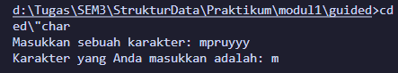
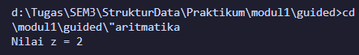
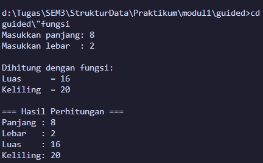
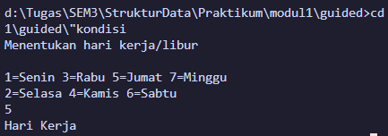
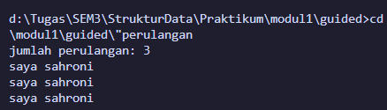
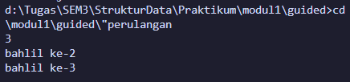
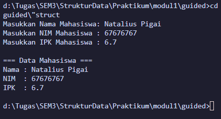
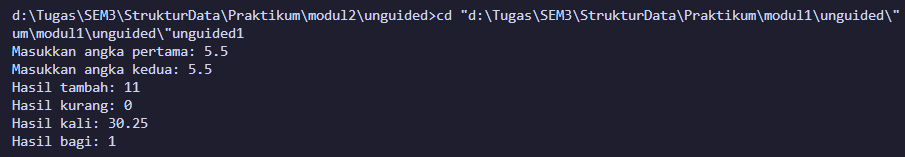
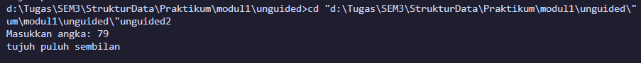
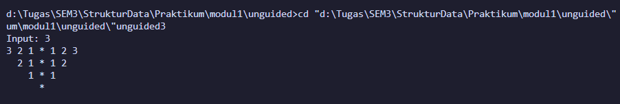

# <h1 align="center">Laporan Praktikum Modul 1 <br> PENGENALAN BAHASA C++ (BAGIAN PERTAMA)</h1>

<p align="center">KEISHIN NAUFA ALFARIDZHI - 103112400061</p>

## Dasar Teori

C++ adalah bahasa pemrograman tingkat tinggi yang dikembangkan oleh Bjarne Stroustrup pada awal 1980-an di Bell Labs. Dirancang sebagai versi yang lebih lengkap dari bahasa pemrograman C, ada banyak fitur tambahan yang disertakan oleh C++.

Fitur ini termasuk object-oriented programming (OOP), pengelolaan memori secara manual, dan penggunaan template generik. Hasilnya, bahasa pemrograman ini pun menjadi lebih fleksibel dan efisien untuk berbagai kebutuhan.

C++ juga dirancang untuk menangani proyek pemrograman kompleks, termasuk aplikasi dengan performa tinggi seperti sistem operasi dan software grafis. Selain itu, C++ mendukung berbagai gaya pemrograman, mulai dari prosedural, generik, hingga berorientasi objek sehingga cocok untuk pengembangan software skala besar.

Berikut merupakan konsep dasar dalam bahasa C++

### 1. **Variabel**

Variabel adalah tempat penyimpanan data dalam program, yang memiliki nama dan nilai tertentu. Di C++, variabel memiliki tipe data yang menentukan jenis nilai yang bisa disimpan.

Berikut adalah tipe-tipe data yang ada dalam variabel C++:

- bool: singkatan dari tipe data boolean, yang hanya berisi dua nilai, yaitu True atau False.
- char: kependekan dari character, yaitu tipe data huruf dari A sampai Z.
- int: kepanjangannya adalah integer, yaitu tipe berupa angka.
- float dan double: tipe data yang berupa angka pecahan, contohnya 1,33.
- string: tipe data dalam bentuk kumpulan karakter, seperti “bahasa pemrograman C++“.

Selain itu, variabel bisa bersifat konstan dengan kata kunci const, yang artinya nilainya tidak bisa diubah setelah ditentukan. C++ juga mendukung pointer, yaitu variabel yang menyimpan alamat memori sehingga developer bisa mengontrol memori secar langsung.

Penulisan variabel dalam C++ terdiri dari dua langkah, yaitu deklarasi dan inisialisasi.

### 2. **Syntax**

Sintaks merupakan pedoman dan peraturan yang harus diikuti ketika menuliskan baris kode/instruksi dalam bahasa pemrograman. Selain itu, sintaks juga dapat dipandang sebagai kerangka yang menentukan struktur bahasa pemrograman.

Bahasa C++ juga memiliki sintaks untuk fungsi-fungsi yang sudah disediakan. Instruksi yang berbeda memiliki sintaks yang berbeda yang menentukan penggunaannya, tetapi program C++ juga memiliki aturan sintaks dasar yang diikuti di seluruh program.

- #include <iostream> : bagian ini disebut preprocessor directive untuk menyertakan file header.

- <iostream> : memberikan akses ke fungsi input-output standar dalam C++.

- using namespace std : bagian ini disebut deklarasi yang memberi tahu program untuk menggunakan namespace std yang berisi banyak fungsi dan objek standar.

- int main() : bagian ini disebut deklarasi fungsi utama (main) yang merupakan pintu masuk eksekusi untuk program C++.

- { dan } : bagian ini disebut kurung kurawal membuka dan menutup blok baris kode untuk fungsi main.

- Semicolon ( ; ) : setiap baris kode dalam contoh di atas diakhiri dengan simbol titik koma ( ; ). Simbol ini berfungsi sebagai penanda akhir dari setiap baris kode dalam program. Ketika kompiler menemui titik koma ini, proses eksekusi pada baris tersebut dihentikan dan lanjut ke baris kode berikutnya.

- return 0; : bagian ini disebut pernyataan kembalian yang mengindikasikan bahwa program telah selesai dengan sukses, sedangkan 0 adalah kode keluaran yang menunjukkan tidak ada kesalahan.

### 3. **Komentar**

Komentar dalam bahasa pemrograman C++ bertujuan untuk memberikan penjelasan mengenai setiap baris kode dengan tujuan memudahkan pembacaan. Penulisan komentar ini dilakukan untuk menyediakan informasi yang relevan terkait dengan implementasi kode yang sedang dibuat. Praktik ini umum dilakukan oleh para programmer sebagai bagian dari dokumentasi proyek mereka.

### 4. **Operasi Aritmatika**

Aritmatika adalah cabang ilmu matematika yang membahas perhitungan dasar "kabataku", yakni operasi perkalian, pembagian, penambahan dan pengurangan.

Selain keempat operasi di atas, bahasa C++ juga memiliki operasi modulo division, atau operator % yang dipakai untuk mencari sisa hasil bagi.

Berikut merupakan operasi aritmatika yang dapat dilakukan dalam bahasa C++.

- +=: assignment penambahan (Contoh: A += 7 ekuivalen dengan A = A + 7).
- -= : assignment pengurangan.
- \*= : assignment perkalian.
- /= : assignment pembagian.
- %=: assignment mod.

### 5. **Control Structures**

Control structure mengatur alur eksekusi program berdasarkan kondisi tertentu. Ada beberapa control structure utama dalam C++, termasuk if-else untuk percabangan serta for, while, dan do-while untuk loop atau perulangan.

Dengan struktur ini, program bisa memberikan respons yang berbeda tergantung pada input atau kondisi yang terjadi selama runtime. Control structure memastikan efisiensi dalam pemrosesan, terutama saat menangani data besar atau algoritma yang kompleks.

**if**<br>
Statement `if` digunakan untuk mengevaluasi ekspresi logis yang menghasilkan nilai `true` atau `false`. Apabila nilainya `true`, blok kode di dalam `if` akan dieksekusi. Kalau tidak, blok tersebut akan dilewati.

**else if dan else**<br>
Apabila kondisi di dalam `if` bernilai `false`, Anda bisa menggunakan `else if` untuk memeriksa kondisi lainnya. Kalau semua kondisi `if` dan `else if` bernilai `false`, blok `else` akan dijalankan sebagai opsi terakhir.

**for**<br>
Loop `for` digunakan untuk melakukan pengulangan dengan jumlah yang diketahui. Struktur ini mencakup **inisialisasi**, **kondisi**, dan **inkrementasi/dekrementasi** dalam satu baris.

Contohnya adalah sebagai berikut:

```c++
...
int main() {
for (int i = 0; i < 5; i++) {
    cout << "Perulangan ke-" << i << endl;
}
```

Pada contoh di atas, variabel `i` diinisialisasi dengan nilai 0. Loop akan berulang selama `i < 5`, dan setiap kali loop berakhir, nilai `i` akan bertambah 1. Pengulangan akan berhenti saat kondisi `i < 5` tidak lagi terpenuhi.

**while**<br>
Loop `while` akan terus mengeksekusi blok kode selama ekspresi kondisional bernilai `true`. Pengulangan akan berhenti begitu kondisi menjadi `false`.

**do-while**<br>
Dengan `do-while`, blok kode akan dieksekusi minimal satu kali, bahkan meskipun kondisinya bernilai `false` saat pemeriksaan pertama. Setelah satu kali eksekusi, kondisi akan diperiksa untuk menentukan apakah loop akan dijalankan lagi.

### 6. **Function**

Sebuah Function dalam C++ adalah blok kode yang dapat menerima input (dalam bentuk parameter) dari pemanggilnya, melakukan serangkaian operasi, dan secara opsional mengembalikan nilai sebagai output. Function sangat berguna untuk mengorganisir kode secara terstruktur dan dapat digunakan kembali.

**Deklarasi Function**<br>
Sebuah deklarasi Function minimal terdiri dari tipe pengembalian, nama Function, dan daftar parameter.

**Definisi Function**<br>
Definisi Function terdiri dari deklarasi dan body Function. Body Function adalah bagian dari Function yang berisi kode yang akan dieksekusi ketika Function dipanggil.

**Parameter dan Argumen**<br>
Sebuah Function memiliki daftar parameter yang memungkinkan pemanggil untuk meneruskan argumen ke dalam Function. Argumen adalah nilai konkret yang dilewatkan ke Function. Anda dapat menggunakan referensi atau nilai untuk mem-pass argumen ke dalam Function.

**Jenis Return**<br>
Jenis return function merujuk pada nilai yang dikembalikan oleh suatu fungsi setelah melakukan operasi atau pemrosesan tertentu. Dalam bahasa pemrograman C++, sebuah function dapat mengembalikan berbagai jenis nilai tergantung pada kebutuhan dan logika programnya.

## Guided

### 1. Guided - Char

Program untuk membaca karakter dari sebuah input.

```c++
#include <iostream>
using namespace std;
int main()
{
    string ch;
    cout << "Masukkan sebuah karakter: ";

    // cin >> ch;
    // atau
    ch = getchar();  // Menggunakan getchar() untuk membaca satu karakter

    cout << "Karakter yang Anda masukkan adalah: " << ch << endl;
    return 0;
}
```

> output<br> 

Program ini berfungsi untuk membaca karakter dari sebuah input. Terdapat 2 cara untuk membaca input yaitu menggunakan syntax `cin` dan `getchar()`. Keduanya memiliki fungsi berbeda, `cin` akan membaca seluruh karakter input dan `getchar()` hanya akan membaca karakter pertama dari input.

### 2. Guided - Aritmatika

Program pengenalan aritmatika pada bahasa **C++**.

```c++
#include <iostream>
using namespace std;
int main()
{
    int W, X, Y;
    float Z;
    X = 7;
    Y = 3;
    W = 1;
    Z = (X + Y) / (Y + W);
    cout << "Nilai z = " << Z << endl;
    return 0;
}
```

> output<br> 

Program ini bertujuan untuk mencari nilai dari rumus Z yang memiliki variabel X, Y dan W. Rumus dari Z adalah:
<br>

<br>
Nilai X, Y dan W sebelumnya telah ditentukan pada code dan program akan langsung cetak nilai dari Z pada terminal.

### 3. Guided - Function

Program pengenalan cara membuat dan memanggil function dan prosedur.

```c++
#include <iostream>
using namespace std;

// Prosedur: hanya menampilkan hasil, tidak mengembalikan nilai
void tampilkanHasil(double p, double l)
{
    cout << "\n=== Hasil Perhitungan ===" << endl;
    cout << "Panjang : " << p << endl;
    cout << "Lebar   : " << l << endl;
    cout << "Luas    : " << p * l << endl;
    cout << "Keliling: " << 2 * (p + l) << endl;
}

// Fungsi: mengembalikan nilai luas
double hitungLuas(double p, double l)
{
    return p * l;
}

// Fungsi: mengembalikan nilai keliling
double hitungKeliling(double p, double l)
{
    return 2 * (p + l);
}

int main()
{
    double panjang, lebar;

    cout << "Masukkan panjang: ";
    cin >> panjang;
    cout << "Masukkan lebar  : ";
    cin >> lebar;

    // Panggil fungsi
    double luas = hitungLuas(panjang, lebar);
    double keliling = hitungKeliling(panjang, lebar);

    cout << "\nDihitung dengan fungsi:" << endl;
    cout << "Luas      = " << luas << endl;
    cout << "Keliling  = " << keliling << endl;

    // Panggil prosedur
    tampilkanHasil(panjang, lebar);

    return 0;
}
```

> Output<br> 

Function dan Prosedur bekerja dengan cara yang mirip tapi berbeda. Mereka sama-sama membutuhkan parameter, bedanya adalah function mengembalikan (return) value sedangkan prosedur tidak mengembalikan value. Perbedaan lainnya adalah, pada **C++** function didekl;arasikan dengan return type `int`, `double`, dan lain-lain. Sedangkan prosedur dideklarasikan dengan return type `void`.
<br>
Terdapat 1 prosedur dan 2 function pada program di atas, yaitu:

- `tampilkanHasil()` -> Prosedur
- `hitungLuas()` -> Function
- `hitungKeliling()` -> Function

### 4. Guided - Kondisi

Pengenalan kondisi `switch-case` pada bahasa **C++**.

```c++
#include <iostream>
using namespace std;

int main()
{
    int kode_hari;
    cout << "Menentukan hari kerja/libur\n"<<endl;
    cout << "1=Senin 3=Rabu 5=Jumat 7=Minggu "<<endl;
    cout << "2=Selasa 4=Kamis 6=Sabtu "<<endl;
    cin >> kode_hari;
    switch (kode_hari)
    {
    case 1:
    case 2:
    case 3:
    case 4:
    case 5:
        cout<<"Hari Kerja";
        break;
    case 6:
    case 7:
        cout<<"Hari Libur";
        break;
    default:
        cout<<"Kode masukan salah!!!";
    }
    return 0;
}
```

> output<br> 

Penggunaan `switch-case` dalam bahasa **C++** sama dengan bahasa pemrograman lainnya yang mana terdapat `switch`, kemudian `case` untuk memilih kondisi, lalu `default` untuk pilihan otomatis jika tidak ada value yang cocok dengan kondisi pada `case`.

### 5. Guided - Loop

Pengenalaan `for` loop dan `do-while` loop dalam bahasa **C++**.
<br>
&nbsp; a. `for` Loop

```c++
#include <iostream>
using namespace std;

// for loop
int main()
{
    int jum;
    cout << "jumlah perulangan: ";
    cin >> jum;
    for (int i = 0; i < jum; i++)
    {
        cout << "saya sahroni\n";
    }
    return 1;
}
```

> output<br> 

`for` loop biasanya digunakan jika jumlah perulangan sudah diketahui sejak awal.
<br>

&nbsp; b. `do-while` loop

```c++
...
// do-while loop
int main()
{
    int i = 1;
    int jum;
    cin >> jum;
    do
    {
        cout << "bahlil ke-" << (i + 1) << endl;
        i++;
    } while (i < jum);
    return 0;
}
```

> output<br> 

`do-while` loop biasanya digunakan jika kita ingin perintah dijalankan setidaknya satu kali, baru kemudian dicek kondisi perulangannya.

### 6. Guided - Struct

Menyimpan berbagai nilai pada bahasa **C++**.

```c++
#include <iostream>
#include <string>
using namespace std;

// Definisi struct
struct Mahasiswa {
    string nama;
    string nim;
    float ipk;
};

int main() {

    Mahasiswa mhs1;

    cout << "Masukkan Nama Mahasiswa: ";
    getline(cin, mhs1.nama);
    // cin >> mhs1.nama;
    cout << "Masukkan NIM Mahasiswa : ";
    cin >> mhs1.nim;
    cout << "Masukkan IPK Mahasiswa : ";
    cin >> mhs1.ipk;

    cout << "\n=== Data Mahasiswa ===" << endl;
    cout << "Nama : " << mhs1.nama << endl;
    cout << "NIM  : " << mhs1.nim << endl;
    cout << "IPK  : " << mhs1.ipk << endl;

    return 0;
}
```

> output<br> 

Struct adalah kumpulan variabel dengan tipe data berbeda yang digabungkan dalam satu nama, sehingga memudahkan penyimpanan data yang saling berhubungan.
<br>

Pada program ini struct digunaknan untuk menyimpan data mahasiswa seperti variabel **nama** dengan tipe data `string`, **nim** dengan tipe data `string`, terakhir ada **ipk** dengan tipe data `float`. Variabel dalam struct tidak terbatas, dapat ditambahkan atau dikurangi sesuai dengan kebutuhan program.

## Unguided

### 1. Unguided - Operasi Dasar Aritmatika

Buatlah program yang menerima input-an dua buah bilangan betipe float, kemudian
memberikan output-an hasil penjumlahan, pengurangan, perkalian, dan pembagian dari dua bilangan tersebut.

```c++
#include <iostream>
using namespace std;

int main()
{
    double angka1, angka2;
    double tambah, kurang, kali, bagi; // Keishin

    cout << "Masukkan angka pertama: ";
    cin >> angka1;
    cout << "Masukkan angka kedua: ";
    cin >> angka2;

    tambah = angka1 + angka2;
    kurang = angka1 - angka2;
    kali = angka1 * angka2;
    bagi = angka1 / angka2;

    cout << "Hasil tambah: " << tambah << endl;
    cout << "Hasil kurang: " << kurang << endl; // 103112400061
    cout << "Hasil kali: " << kali << endl;
    cout << "Hasil bagi: " << bagi << endl;

    return 0;
}
```

> output<br> 

Program dimulai dengan mendeklarasikan variabel bertipe `float` diantaranya adalah **angka1** dan **angka2** untuk menyimpan input, **tambah**, **kurang**, **kali** dan **bagi** untuk menyimpan rumus operasi dasar aritmatika.
<br>

User akan menginput **angka1** dan **angka2** yang kemudian akan dilakukan operasi dasar aritmatika oleh variabel **tambah**, **kurang**, **kali** dan **bagi**. Setelah itu akan dicetak hasil dari operasi aritmatika sebelumnya.

### 2. Unguided - Konversi Input Angka

Buatlah sebuah program yang menerima masukan angka dan mengeluarkan output nilai angka tersebut dalam bentuk tulisan. Angka yang akan di- input-kan user adalah bilangan bulat positif mulai dari 0 s.d 100.

```c++
#include <iostream>
using namespace std;

string konversiAngkaHuruf(int angka)
{
    string huruf;
    switch (angka)
    {
        case 1: huruf = "satu"; break;
        case 2: huruf = "dua"; break;
        case 3: huruf = "tiga"; break; // Keishin
        case 4: huruf = "empat"; break;
        case 5: huruf = "lima"; break;
        case 6: huruf = "enam"; break;
        case 7: huruf = "tujuh"; break;
        case 8: huruf = "delapan"; break;
        case 9: huruf = "sembilan"; break;
        case 10: huruf = "sepuluh"; break;
        case 11: huruf = "sebelas"; break;
        case 100: huruf = "seratus"; break;
        default: huruf = "Hanya angka 1-100 gng."; break;
    }
    return huruf;
}

int main()
{
    int input, satuan, puluhan;
    cout << "Masukkan angka: ";
    cin >> input; // 103112400061

    puluhan = input / 10;
    satuan = input % 10;

    if (input <= 11)
    {
        cout << konversiAngkaHuruf(input);
    }

    if (input > 11 && input < 20)
    {
        cout << konversiAngkaHuruf(satuan) << " belas";
    }

    if (input >= 20 && input < 100) // Keishin
    {
        if (satuan == 0)
            cout << konversiAngkaHuruf(puluhan) << " puluh";
        else
            cout << konversiAngkaHuruf(puluhan) << " puluh " << konversiAngkaHuruf(satuan);
    }

    if (input == 100)
    {
        cout << konversiAngkaHuruf(input);
    }

    cout << endl;

    return 0;
}

```

> output<br> 

Terdapat 3 variabel utama dengan tipe data `int` yaitu **input**, **satuan** dan **puluhan**. Kemudian terdapat 1 function bernama **konversiAngkaHuruf()** dengan return type `string` yang berguna untuk membaca input `int` menjadi `string`.
<br>

Dalam function **konversiAngkaHuruf()** digunakan logika percabangan `switch-case` untuk membaca angka 1 s.d. 11 dan 100.
<br>

Kemudian pada function **main()**, setelah melakukan input maka angka dari input akan dicari angka satuan dan puluhannya dengan membagi ( `/` ) input dengan 10 untuk mendapatkan puluhan dan modulo ( `%` ) input dengan 10 untuk mendapatkan satuan. Selanjutnya cek input dengan logika percabangan `if-else`. Terdapat 4 kategori, yang pertama `input` <= `11`, kedua `input` > `11` dan `input` <= `20`, ketiga `input` > `20` dan `input` < `99`, yang keempat `input` = `100`. Masing-masing percabangan akan mencetak `string` dengan memanggil function **konversiAngkaHuruf()** dan menambahkan `string` tambahan jika/sesuai kebutuhan.

### 3. Unguided 3 - Pattern with Loop

Buatlah program yang dapat memberikan _input_ dan _output_ sebagai berikut.

```c++
#include <iostream>
using namespace std;

int main() // 103112400061
{
    int input;
    cout << "Input: ";
    cin >> input;

    for (int i = input + 1; i >= 1; i--) // Loop
    {
        for (int k = 0; k < input + 1 - i; k++) // Nested Loop 1
        { // Keishin
            cout << "  ";
        }
        for (int j = i-1; j >= 1; j--) // Nested Loop 2
        {
            cout << j << " ";
        }
        cout << "* ";
        for (int j = 1; j < i; j++) // Nested Loop 3
        {
            cout << j << " ";
        }
        cout << endl;
    }

    return 0;
}
```

> output<br> 

Hanya terdapat 1 variabel untuk input saja. Memiliki 1 `loop` dan 3 `nested loop`. Berikut merupakan algoritma dari cetak pola: <br>

1. **Loop** <br>
   Untuk menentukan berapa baris yang akan dicetak. Pada inisialisasi, `input` ditambah dengan 1 karena butuh baris tambahan untuk pucuk bintang paling bawah. Menambah baris dengan syntax `cout << endl;`.
2. **Nested Loop 1** <br>
   Untuk mencetak spasi pada sebelah kiri. Ini penting agar pattern dapat tercetak dengan benar.
3. **Nested Loop 2** <br>
   Untuk mencetak angka pada ruas sebelah kiri. Mengambil value `j` = `i - 1` dan decrement agar cetak dimulai dari value `input` dan countdown (hitung mundur).
4. **Print `*`** <br>
   Cetak `*` dilakukan setelah **Nested Loop 2**
5. **Nested Loop 3** <br>
   Untuk mencetak angka pada ruas sebelah kanan. Mulai dari `j` = `1` dan increment agar cetak dimulai dari angka 1.
6. **Cetak baris baru**

## Referensi

1. _Hostinger_. https://www.hostinger.com/id/tutorial/bahasa-pemrograman-cpp. Diakses pada 03 Oktober 2025.
2. _Dicoding_. https://www.dicoding.com/blog/memahami-esensi-bahasa-pemrograman-c/. Diakses pada 03 Oktober 2025.
3. _Duniailkom_. https://www.duniailkom.com/tutorial-belajar-c-plus-plus-jenis-jenis-operator-aritmatika-bahasa-c-plus-plus/. Diakses pada 03 Oktober 2025.
4. _kodingakademi_. https://www.kodingakademi.id/function-c-panduan-lengkap/. Diakses pada 03 Oktober 2025.
