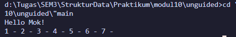
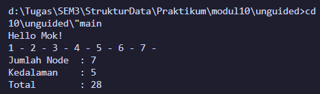
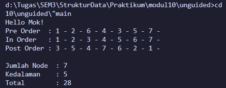

# <h1 align="center">Laporan Praktikum Modul 8 <br>QUEUE</h1>

<p align="center">KEISHIN NAUFA ALFARIDZHI - 103112400061</p>

## Dasar Teori

C++ adalah bahasa pemrograman tingkat tinggi yang dikembangkan oleh Bjarne Stroustrup pada awal 1980-an di Bell Labs. Dirancang sebagai versi yang lebih lengkap dari bahasa pemrograman C, ada banyak fitur tambahan yang disertakan oleh C++.

Fitur ini termasuk object-oriented programming (OOP), pengelolaan memori secara manual, dan penggunaan template generik. Hasilnya, bahasa pemrograman ini pun menjadi lebih fleksibel dan efisien untuk berbagai kebutuhan.

C++ juga dirancang untuk menangani proyek pemrograman kompleks, termasuk aplikasi dengan performa tinggi seperti sistem operasi dan software grafis. Selain itu, C++ mendukung berbagai gaya pemrograman, mulai dari prosedural, generik, hingga berorientasi objek sehingga cocok untuk pengembangan software skala besar.

Berikut merupakan konsep dasar dalam bahasa C++

### 1. **Variabel**

Variabel adalah tempat penyimpanan data dalam program, yang memiliki nama dan nilai tertentu. Di C++, variabel memiliki tipe data yang menentukan jenis nilai yang bisa disimpan.

Berikut adalah tipe-tipe data yang ada dalam variabel C++:

- bool: singkatan dari tipe data boolean, yang hanya berisi dua nilai, yaitu True atau False.
- char: kependekan dari character, yaitu tipe data huruf dari A sampai Z.
- int: kepanjangannya adalah integer, yaitu tipe berupa angka.
- float dan double: tipe data yang berupa angka pecahan, contohnya 1,33.
- string: tipe data dalam bentuk kumpulan karakter, seperti “bahasa pemrograman C++“.

Selain itu, variabel bisa bersifat konstan dengan kata kunci const, yang artinya nilainya tidak bisa diubah setelah ditentukan. C++ juga mendukung pointer, yaitu variabel yang menyimpan alamat memori sehingga developer bisa mengontrol memori secar langsung.

Penulisan variabel dalam C++ terdiri dari dua langkah, yaitu deklarasi dan inisialisasi.

### 2. **Syntax**

Sintaks merupakan pedoman dan peraturan yang harus diikuti ketika menuliskan baris kode/instruksi dalam bahasa pemrograman. Selain itu, sintaks juga dapat dipandang sebagai kerangka yang menentukan struktur bahasa pemrograman.

Bahasa C++ juga memiliki sintaks untuk fungsi-fungsi yang sudah disediakan. Instruksi yang berbeda memiliki sintaks yang berbeda yang menentukan penggunaannya, tetapi program C++ juga memiliki aturan sintaks dasar yang diikuti di seluruh program.

- #include <iostream> : bagian ini disebut preprocessor directive untuk menyertakan file header.

- <iostream> : memberikan akses ke fungsi input-output standar dalam C++.

- using namespace std : bagian ini disebut deklarasi yang memberi tahu program untuk menggunakan namespace std yang berisi banyak fungsi dan objek standar.

- int main() : bagian ini disebut deklarasi fungsi utama (main) yang merupakan pintu masuk eksekusi untuk program C++.

- { dan } : bagian ini disebut kurung kurawal membuka dan menutup blok baris kode untuk fungsi main.

- Semicolon ( ; ) : setiap baris kode dalam contoh di atas diakhiri dengan simbol titik koma ( ; ). Simbol ini berfungsi sebagai penanda akhir dari setiap baris kode dalam program. Ketika kompiler menemui titik koma ini, proses eksekusi pada baris tersebut dihentikan dan lanjut ke baris kode berikutnya.

- return 0; : bagian ini disebut pernyataan kembalian yang mengindikasikan bahwa program telah selesai dengan sukses, sedangkan 0 adalah kode keluaran yang menunjukkan tidak ada kesalahan.

### 3. **Komentar**

Komentar dalam bahasa pemrograman C++ bertujuan untuk memberikan penjelasan mengenai setiap baris kode dengan tujuan memudahkan pembacaan. Penulisan komentar ini dilakukan untuk menyediakan informasi yang relevan terkait dengan implementasi kode yang sedang dibuat. Praktik ini umum dilakukan oleh para programmer sebagai bagian dari dokumentasi proyek mereka.

### 4. **Operasi Aritmatika**

Aritmatika adalah cabang ilmu matematika yang membahas perhitungan dasar "kabataku", yakni operasi perkalian, pembagian, penambahan dan pengurangan.

Selain keempat operasi di atas, bahasa C++ juga memiliki operasi modulo division, atau operator % yang dipakai untuk mencari sisa hasil bagi.

Berikut merupakan operasi aritmatika yang dapat dilakukan dalam bahasa C++.

- +=: assignment penambahan (Contoh: A += 7 ekuivalen dengan A = A + 7).
- -= : assignment pengurangan.
- \*= : assignment perkalian.
- /= : assignment pembagian.
- %=: assignment mod.

### 5. **Control Structures**

Control structure mengatur alur eksekusi program berdasarkan kondisi tertentu. Ada beberapa control structure utama dalam C++, termasuk if-else untuk percabangan serta for, while, dan do-while untuk loop atau perulangan.

Dengan struktur ini, program bisa memberikan respons yang berbeda tergantung pada input atau kondisi yang terjadi selama runtime. Control structure memastikan efisiensi dalam pemrosesan, terutama saat menangani data besar atau algoritma yang kompleks.

**if**<br>
Statement `if` digunakan untuk mengevaluasi ekspresi logis yang menghasilkan nilai `true` atau `false`. Apabila nilainya `true`, blok kode di dalam `if` akan dieksekusi. Kalau tidak, blok tersebut akan dilewati.

**else if dan else**<br>
Apabila kondisi di dalam `if` bernilai `false`, Anda bisa menggunakan `else if` untuk memeriksa kondisi lainnya. Kalau semua kondisi `if` dan `else if` bernilai `false`, blok `else` akan dijalankan sebagai opsi terakhir.

**for**<br>
Loop `for` digunakan untuk melakukan pengulangan dengan jumlah yang diketahui. Struktur ini mencakup **inisialisasi**, **kondisi**, dan **inkrementasi/dekrementasi** dalam satu baris.

Contohnya adalah sebagai berikut:

```c++
...
int main() {
for (int i = 0; i < 5; i++) {
    cout << "Perulangan ke-" << i << endl;
}
```

Pada contoh di atas, variabel `i` diinisialisasi dengan nilai 0. Loop akan berulang selama `i < 5`, dan setiap kali loop berakhir, nilai `i` akan bertambah 1. Pengulangan akan berhenti saat kondisi `i < 5` tidak lagi terpenuhi.

**while**<br>
Loop `while` akan terus mengeksekusi blok kode selama ekspresi kondisional bernilai `true`. Pengulangan akan berhenti begitu kondisi menjadi `false`.

**do-while**<br>
Dengan `do-while`, blok kode akan dieksekusi minimal satu kali, bahkan meskipun kondisinya bernilai `false` saat pemeriksaan pertama. Setelah satu kali eksekusi, kondisi akan diperiksa untuk menentukan apakah loop akan dijalankan lagi.

### 6. **Function**

Sebuah Function dalam C++ adalah blok kode yang dapat menerima input (dalam bentuk parameter) dari pemanggilnya, melakukan serangkaian operasi, dan secara opsional mengembalikan nilai sebagai output. Function sangat berguna untuk mengorganisir kode secara terstruktur dan dapat digunakan kembali.

**Deklarasi Function**<br>
Sebuah deklarasi Function minimal terdiri dari tipe pengembalian, nama Function, dan daftar parameter.

**Definisi Function**<br>
Definisi Function terdiri dari deklarasi dan body Function. Body Function adalah bagian dari Function yang berisi kode yang akan dieksekusi ketika Function dipanggil.

**Parameter dan Argumen**<br>
Sebuah Function memiliki daftar parameter yang memungkinkan pemanggil untuk meneruskan argumen ke dalam Function. Argumen adalah nilai konkret yang dilewatkan ke Function. Anda dapat menggunakan referensi atau nilai untuk mem-pass argumen ke dalam Function.

**Jenis Return**<br>
Jenis return function merujuk pada nilai yang dikembalikan oleh suatu fungsi setelah melakukan operasi atau pemrosesan tertentu. Dalam bahasa pemrograman C++, sebuah function dapat mengembalikan berbagai jenis nilai tergantung pada kebutuhan dan logika programnya.

### 7. **Array**

Array merupakan struktur data yang digunakan untuk `menyimpan sekumpulan data` dalam satu tempat. Setiap data dalam Array memiliki indeks, sehingga kita akan mudah memprosesnya.

Indeks array selalu dimulai dari angka nol (`0`). Pada teori struktur data ukuran array akan bergantung dari banyaknya data yang disimpan di dalamnya.

**Cara Membuat Array pada C++**<br>
Pada C++, array dapat kita buat dengan cara seperti ini.

```c++
// membuat array kosong dengan tipe data integer dan panjang 10
int nama_array[10];

// membuat array dengan langsung diisi
int nama_arr[3] = {0, 3, 2}
```

Cara membuat array hampir sama seperti cara membuat variabel biasa. Bedanya pada array kita harus menentukan panjangnya.

**Cara Mengambil Data dari Array**<br>
Seperti yang sudah kita ketahui, array akan menyimpan sekumpulan data dan memberinya nomer indeks agar mudah diakses. Indeks array selalu dimulai dari nol `0`.

Misalkan kita punya array seperti ini: <br>
`char huruf[5] = {'a', 'b', 'c', 'd', 'e'};`<br>
Bagaimana cara mengambil huruf `c`?

Jawabannya:
`huruf[2];`

**Mengisi Ulang Data Array**<br>
Data pada array dapat kita isi ulang dengan cara seperti ini:<br>
`huruf[2] = 'z';`<br>
Maka isi array `huruf` pada indeks ke-2 akan bernilai z`.

### 8. **Linked List**

Dalam C++, linked list merupakan struktur data linear yang memungkinkan user untuk menyimpan data di lokasi memory yang tidak berurutan. Sebuah linked list didefinisikan sebagai sekumpulan nodes yang dimana tiap node memiliki 2 anggota: value node itu sendiri dan petunjuk next/previous yang menyimpan alamat node berikutnya/sebelumnya.

**Representasi Linked List dalam C++**<br>
Dalam C++, linked list pada dasarnya direpresentasikan oleh pointer ke node pertama, yang umumnya disebut sebagai "**head**" dari list tersebut. Setiam node dalam list didefinisikan oleh struktur yang mencakup data field dan pointer yang mengarah ke struktur dengan tipe yang sama. Jenis struktur ini dikenal sebagai struktur self-referential.

**Singly Linked List**<br>
Singly linked List adalah bentuk paling sederhana dari linked list, di mana setiap node mengandung 2 anggota yaitu data dan next pointer yang menyimpan alamat node berikutnya. Setiap node dalam singly linked list terhubung melalui petunjuk berikutnya, dan penunjuk beriutnya dari node terakhir mengarah ke NULL, yang menandakan akhir dari linked list. Diagram berikut menggambarkan struktur singly linked list: <br>


**Doubly Linked List**<br>
Doubly Linked List adalah jenis linked list yang di mana setiap node mengandung 3 bagian: data, pointer ke node berikutnya, dan pointer ke node sebelumnya. Struktur ini memungkinkan penelusuran daftar ke arah depan dan belakang, berbeda dengan Singly Linked List yang hanya dapat ditelusuri ke arah depan.


### 9. **Stack**

Kontainer stack mengikuti urutan LIFO (Last In First Out) untuk proses insert dan delete. Artinya, elemen yang dimasukkan paling akhir akan dihapus terlebih dahulu, dan elemen yang dimasukkan paling awal akan dihapus terakhir. Hal ini dilakukan dengan insert dan delete elemen hanya pada satu sisi stack yang umumnya disebut sebagai top (puncak) dari stack.

**Operasi dasar Stack**

**1. Inserting Elements**<br>
Dalam stack, elemen baru hanya bisa di-insert di bagian top dari stack dengan menggunakan method push().

**2. Accessing Elements**<br>
Hanya elemen di bagian top dari stack yang bisa diakses menggunakan method top().

**3. Deleting Elements**<br>
Dalam stack, hanya elemen di bagian top yang bisa di-delete menggunakan method pop() dalam satu operasi.

**4. empty()**<br>
Method ini mengecek apakah stack kosong. Method ini mengembalikan true jika stack tidak memiliki elemen; jika tidak, method ini mengembalikan false.

**5. Size of stack**<br>
Function size() pada stack mengembalikan jumlah elemen yang sedang ada di dalam stack. Function ini membantu mengetahui berapa banyak item yang tersimpan tanpa memodifikasi stack.

### 10. **Queue**

Queue menyimpan banyak elemen dalam urutan tertentu yang disebut FIFO.

FIFO adalah singkatan dari First In, First Out. Untuk memvisualisasikan FIFO, bayangkan queue seperti orang-orang yang mengantre di sebuah supermarket. Orang yang pertama kali berdiri dalam antrean adalah orang pertama yang bisa membayar dan keluar dari supermarket. Cara pengorganisasian elemen seperti ini disebut FIFO dalam ilmu komputer dan pemrograman.

Berbeda dengan vector, elemen dalam queue tidak diakses berdasarkan nomor indeks. Karena elemen queue di-add di bagian belakang dan di-remove dari bagian depan, kita hanya bisa mengakses elemen yang ada di bagian front atau back saja.

**Operasi dasar Stack**<br>
Terdapat 2 operasi berupa Enqueue untuk insert, dan Dequeue untuk delete.

## Unguided

Di bawah ini merupakan code untuk pengerjaan unguided soal 1-3.

`bstree.h`

```c++
#ifndef SERVICE_H_INCLUDED
#define SERVICE_H_INCLUDED
#include <string>
using namespace std;

using infotype = int;
using address = struct Node*;
struct Node {
    infotype info;
    address left, right;
};

address alokasi(infotype x);
void insertNode(address &root, infotype x);
address findNode(infotype x, address root);
int hitungJumlahNode(address root);
int hitungTotalInfo(address root);
int hitungKedalaman(address root, int start);

void printInOrder(address root);
void printPreOrder(address root);
void printPostOrder(address root);

#endif
```

<br>

`bstree.cpp`

```c++
#include <iostream>
#include "bstree.h"
using namespace std;

address alokasi(infotype x) {
    address baru = new Node;
    baru->info = x;
    baru->left = baru->right = NULL;
    return baru;
}

void insertNode(address &root, infotype x) {
    if (root == NULL) {
        root = alokasi(x);
        return;
    }

    if (x < root->info)
        insertNode(root->left, x);
    else if (x > root->info)
        insertNode(root->right, x);
}

address findNode(infotype x, address root) {
    if (root == NULL || root->info == x)
        return root;

    if (x < root->info)
        return findNode(x, root->left);

    return findNode(x, root->right);
}

int hitungJumlahNode(address root) {
    if (root == NULL) {
        return 0;
    }

    return 1 + hitungJumlahNode(root->right) + hitungJumlahNode(root->left);
}

int hitungTotalInfo(address root) {
    if (root == NULL) {
        return 0;
    }

    return root->info + hitungTotalInfo(root->right) + hitungTotalInfo(root->left);
}

int hitungKedalaman(address root, int start) {
    if (root == NULL) {
        return start;
    }

    int left = hitungKedalaman(root->left, start + 1);
    int right = hitungKedalaman(root->right, start + 1);

    if (left > right) {
        return left;
    }
    return right;
}

void printPreOrder(address root) {
    if (root != NULL) {
        cout << root->info << " - ";
        printPreOrder(root->left);
        printPreOrder(root->right);
    }
}

void printInOrder(address root) {
    if (root != NULL) {
        printInOrder(root->left);
        cout << root->info << " - ";
        printInOrder(root->right);
    }
}

void printPostOrder(address root) {
    if (root != NULL) {
        printPostOrder(root->left);
        printPostOrder(root->right);
        cout << root->info << " - ";
    }
}
```

`main.cpp`

```c++
#include <iostream>
#include "bstree.h"
#include "bstree.cpp"
using namespace std;

int main() {
    cout << "Hello Mok!" << endl;
    address root = NULL;
    insertNode(root,1);
    insertNode(root,2);
    insertNode(root,6);
    insertNode(root,4);
    insertNode(root,5);
    insertNode(root,3);
    insertNode(root,6);
    insertNode(root,7);
    cout << "Pre Order  : ";
    printPreOrder(root);
    cout << endl;
    cout << "In Order   : ";
    printInOrder(root);
    cout << endl;
    cout << "Post Order : ";
    printPostOrder(root);
    cout << endl;
    cout<<"\n";
    cout<<"Jumlah Node  : " << hitungJumlahNode(root) << endl;
    cout<<"Kedalaman    : " << hitungKedalaman(root,0) << endl;
    cout<<"Total        : " << hitungTotalInfo(root) << endl;
    return 0;
}
```

### Unguided 1

Buatlah ADT _Binary Search_ Tree menggunakan _Linked list_ sebagai berikut di dalam file
“**bstree.h**”:

```
Type infotype: integer
Type address : pointer to Node
Type Node:  <
info : infotype
left, right : address
>
function alokasi( x : infotype ) → address
procedure insertNode( input/output root : address, input x : infotype )
function findNode( x : infotype, root : address )→address
procedure printInorder( input root : address )
```

Buatlah implementasi ADT _Binary Search_ Tree pada _file_ “**bstree.cpp**” dan cobalah hasil
implementasi ADT pada file “main.cpp”

```c++
#include <iostream>
#include "bstree.h"

using namespace std;
int main() {
    cout << "Hello World" << endl;
    address root = Nil;
    insertNode(root,1);
    insertNode(root,2);
    insertNode(root,6);
    insertNode(root,4);
    insertNode(root,5);
    insertNode(root,3);
    insertNode(root,6);
    insertNode(root,7);
    InOrder(root);
    return 0;
}
```

> output<br>

Program implementasi bstree pada C++. Diimplementasikan menggunakan Linked List dan memiliki 3 operasi yaitu _insert_, _find_ & _print_. Terdapat 3 buah file yang terdiri dari 1 file header (`bstree.h`), 1 file ADT (`bstree.cpp`), dan 1 file utama (`main.cpp`).

1. bstree.h: File header ini bekerja sebagai interface, mendeklarasikan semua struct dan function.

   - infotype: definisi type **integer**.

   - address: definisi type pointer ke struct Node.

   - struct Node: Mendefinisikan infotype sebagai info, dan mendefinsikan dua buah address sebagai left dan right.

2. bstree.cpp: File implementasi ini berisi logic dari semua function yang dideklarasikan di dalam file header.

   - `alokasi()`: Function untuk mengalokasikan memory untuk node baru dengan value x. Return address dari node baru tersebut.

   - `insertNode()`: Prosedur untuk input value x ke dalam bstree. Jika root masih NULL, maka node baru akan menjadi root. Jika tidak, maka function ini akan mengecek apakah value x lebih kecil atau lebih besar dari root, lalu memasukkan value x ke dalam subtree kiri atau kanan secara rekursif.

   - `findNode()`: Function untuk mencari value x dalam bstree. Jika `root = NULL` atau `root->info = x`, maka return root. Jika tidak, maka function akan cek jika `x < root->info`, maka function akan cari value x pada subtree kiri secara rekursif. Jika tidak, maka function akan cari value x pada subtree kanan secara rekursif.

   - `printInOrder()`: Prosedur ini akan print secara InOrder yang mana akan print value dari subtree sebelah kiri, ke tengah, lalu subtree sebelah kanan secara berurutan. Prosedur ini dilakukan secara rekursif.

3. `main.cpp`: File utama untuk memanggil function dari `bstree.cpp` untuk menjalankan operasi bstree.

### Unguided 2

Buatlah implementasi ADT _Queue_ pada file “_queue.cpp_” dengan menerapkan mekanisme _queue_ Alternatif 2 (_head_ bergerak, _tail_ bergerak).

```c++
// unguided 2 - alternatif 2
int dequeue(Queue &Q) {
    if (isEmptyQueue(Q)) {
        cout << "Queue kosong! Tidak ada data yang dihapus." << endl;
    } else {
        cout << "Dequeue: " << Q.info[Q.head] << endl;
        if (Q.head == Q.tail) {
            Q.head = Q.tail = -1;
        } else {
            Q.info[Q.head] = 0;
            Q.head++;
        }
    }
}
```

> output<br>

Perubahan dari alternatif 1 ke alternatif 2 yang terjadi:

- `dequeue()`: Function ini mengambil value paling depan pada Queue dan posisi antrian masih tetap, tidak bergeser ke depan. Setelah mengambil value paling depan, maka pointer head akan mundur sebanyak 1 kali dengan `Q.head++`.

### Unguided 3

Buatlah implementasi ADT _Queue_ pada file “_queue.cpp_” dengan menerapkan mekanisme _queue_ Alternatif 3 (_head_ dan _tail_ berputar).

```c++
bool isFullQueue(const Queue &Q) {
    return (Q.tail + 1) % MAX == Q.head;
}

void enqueue(Queue &Q, infotype x) {
    if (isFullQueue(Q)) {
        cout << "Queue penuh! Tidak bisa menambah data." << endl;
    } else {
        if (isEmptyQueue(Q)) {
            Q.head = Q.tail = 0;
        } else {
            if (Q.tail == MAX - 1) {
                Q.tail = 0;
            } else {
                Q.tail++;
            }
        }
        Q.info[Q.tail] = x;
        cout << "Enqueue: " << x << endl;
    }
}

int dequeue(Queue &Q) {
    if (isEmptyQueue(Q)) {
        cout << "Queue kosong! Tidak ada data yang dihapus." << endl;
    } else {
        cout << "Dequeue: " << Q.info[Q.head] << endl;
        if (Q.head == Q.tail) {
            Q.head = Q.tail = -1;
        } else {
            if (Q.head == MAX - 1) {
                Q.head = 0;
            } else {
                Q.head++;
            }
        }
    }
}

void printInfo(const Queue &Q) {
    if (isEmptyQueue(Q)) {
        cout << "Queue kosong!" << endl;
    } else {
        cout << "Queue : ";
        int i = Q.head;

        while (i != Q.tail) {
            cout << Q.info[i] << " ";
            i = (i + 1) % MAX;
        }

        cout << Q.info[Q.tail] << " ";
        cout << endl;
    }
}
```

> output<br>

Perubahan dari alternatif 1 ke alternatif 2 yang terjadi:

- `isFullQueue()`: Cek apakah tail ada di belakang head `(Q.tail + 1) % MAX == Q.head`.

- `enqueue()`: Tail akan pindah ke awal Queue (`0`) jika sudah berada di akhir Queue (`MAX - 1`).

- `dequeue()`: Setelah mengambil value pada posisi head, maka pointer head akan mundur sebanyak 1 kali dengan `Q.head++`. Head akan pindah ke awal Queue (`0`) jika sudah berada di akhir Queue (`MAX - 1`).

- `printInfo()`: Print tidak dari depan Queue ke belakang, tapi berputar. Dengan cara `i` modulo dengan `MAX` (`i % MAX`), maka `i` akan dapat kembali ke index `0` (awal Queue).

## Referensi

1. _Hostinger_. https://www.hostinger.com/id/tutorial/bahasa-pemrograman-cpp. Diakses pada 03 Oktober 2025.
2. _Dicoding_. https://www.dicoding.com/blog/memahami-esensi-bahasa-pemrograman-c/. Diakses pada 03 Oktober 2025.
3. _Duniailkom_. https://www.duniailkom.com/tutorial-belajar-c-plus-plus-jenis-jenis-operator-aritmatika-bahasa-c-plus-plus/. Diakses pada 03 Oktober 2025.
4. _kodingakademi_. https://www.kodingakademi.id/function-c-panduan-lengkap/. Diakses pada 03 Oktober 2025.
5. _petanikode_ . https://www.petanikode.com/cpp-array/. Diakses pada 06 Oktober 2025.
6. _GeekForGeeks_. https://www.geeksforgeeks.org/cpp/cpp-linked-list/. Diakses pada 13 Oktober 2025.
7. _GeekForGeeks_. https://www.geeksforgeeks.org/cpp/doubly-linked-list-in-cpp/. Diakses pada 27 Oktober 2025.
8. _GeekForGeeks_. https://www.geeksforgeeks.org/cpp/stack-in-cpp-stl/. Diakses pada 4 November 2025.
9. _W3schools_. https://www.w3schools.com/cpp/cpp_queues.asp. Diakses pada 14 November 2025.
