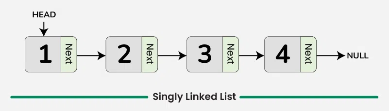
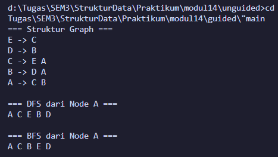
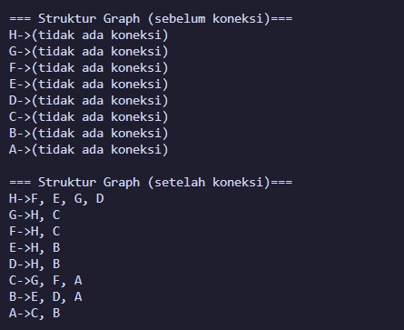

# <h1 align="center">Laporan Praktikum Modul 14 <br>GRAPH</h1>

<p align="center">KEISHIN NAUFA ALFARIDZHI - 103112400061</p>

## Dasar Teori

C++ adalah bahasa pemrograman tingkat tinggi yang dikembangkan oleh Bjarne Stroustrup pada awal 1980-an di Bell Labs. Dirancang sebagai versi yang lebih lengkap dari bahasa pemrograman C, ada banyak fitur tambahan yang disertakan oleh C++.

Fitur ini termasuk object-oriented programming (OOP), pengelolaan memori secara manual, dan penggunaan template generik. Hasilnya, bahasa pemrograman ini pun menjadi lebih fleksibel dan efisien untuk berbagai kebutuhan.

C++ juga dirancang untuk menangani proyek pemrograman kompleks, termasuk aplikasi dengan performa tinggi seperti sistem operasi dan software grafis. Selain itu, C++ mendukung berbagai gaya pemrograman, mulai dari prosedural, generik, hingga berorientasi objek sehingga cocok untuk pengembangan software skala besar.

Berikut merupakan konsep dasar dalam bahasa C++

### 1. **Variabel**

Variabel adalah tempat penyimpanan data dalam program, yang memiliki nama dan nilai tertentu. Di C++, variabel memiliki tipe data yang menentukan jenis nilai yang bisa disimpan.

Berikut adalah tipe-tipe data yang ada dalam variabel C++:

- bool: singkatan dari tipe data boolean, yang hanya berisi dua nilai, yaitu True atau False.
- char: kependekan dari character, yaitu tipe data huruf dari A sampai Z.
- int: kepanjangannya adalah integer, yaitu tipe berupa angka.
- float dan double: tipe data yang berupa angka pecahan, contohnya 1,33.
- string: tipe data dalam bentuk kumpulan karakter, seperti “bahasa pemrograman C++“.

Selain itu, variabel bisa bersifat konstan dengan kata kunci const, yang artinya nilainya tidak bisa diubah setelah ditentukan. C++ juga mendukung pointer, yaitu variabel yang menyimpan alamat memori sehingga developer bisa mengontrol memori secar langsung.

Penulisan variabel dalam C++ terdiri dari dua langkah, yaitu deklarasi dan inisialisasi.

### 2. **Syntax**

Sintaks merupakan pedoman dan peraturan yang harus diikuti ketika menuliskan baris kode/instruksi dalam bahasa pemrograman. Selain itu, sintaks juga dapat dipandang sebagai kerangka yang menentukan struktur bahasa pemrograman.

Bahasa C++ juga memiliki sintaks untuk fungsi-fungsi yang sudah disediakan. Instruksi yang berbeda memiliki sintaks yang berbeda yang menentukan penggunaannya, tetapi program C++ juga memiliki aturan sintaks dasar yang diikuti di seluruh program.

- #include <iostream> : bagian ini disebut preprocessor directive untuk menyertakan file header.

- <iostream> : memberikan akses ke fungsi input-output standar dalam C++.

- using namespace std : bagian ini disebut deklarasi yang memberi tahu program untuk menggunakan namespace std yang berisi banyak fungsi dan objek standar.

- int main() : bagian ini disebut deklarasi fungsi utama (main) yang merupakan pintu masuk eksekusi untuk program C++.

- { dan } : bagian ini disebut kurung kurawal membuka dan menutup blok baris kode untuk fungsi main.

- Semicolon ( ; ) : setiap baris kode dalam contoh di atas diakhiri dengan simbol titik koma ( ; ). Simbol ini berfungsi sebagai penanda akhir dari setiap baris kode dalam program. Ketika kompiler menemui titik koma ini, proses eksekusi pada baris tersebut dihentikan dan lanjut ke baris kode berikutnya.

- return 0; : bagian ini disebut pernyataan kembalian yang mengindikasikan bahwa program telah selesai dengan sukses, sedangkan 0 adalah kode keluaran yang menunjukkan tidak ada kesalahan.

### 3. **Komentar**

Komentar dalam bahasa pemrograman C++ bertujuan untuk memberikan penjelasan mengenai setiap baris kode dengan tujuan memudahkan pembacaan. Penulisan komentar ini dilakukan untuk menyediakan informasi yang relevan terkait dengan implementasi kode yang sedang dibuat. Praktik ini umum dilakukan oleh para programmer sebagai bagian dari dokumentasi proyek mereka.

### 4. **Operasi Aritmatika**

Aritmatika adalah cabang ilmu matematika yang membahas perhitungan dasar "kabataku", yakni operasi perkalian, pembagian, penambahan dan pengurangan.

Selain keempat operasi di atas, bahasa C++ juga memiliki operasi modulo division, atau operator % yang dipakai untuk mencari sisa hasil bagi.

Berikut merupakan operasi aritmatika yang dapat dilakukan dalam bahasa C++.

- +=: assignment penambahan (Contoh: A += 7 ekuivalen dengan A = A + 7).
- -= : assignment pengurangan.
- \*= : assignment perkalian.
- /= : assignment pembagian.
- %=: assignment mod.

### 5. **Control Structures**

Control structure mengatur alur eksekusi program berdasarkan kondisi tertentu. Ada beberapa control structure utama dalam C++, termasuk if-else untuk percabangan serta for, while, dan do-while untuk loop atau perulangan.

Dengan struktur ini, program bisa memberikan respons yang berbeda tergantung pada input atau kondisi yang terjadi selama runtime. Control structure memastikan efisiensi dalam pemrosesan, terutama saat menangani data besar atau algoritma yang kompleks.

**if**<br>
Statement `if` digunakan untuk mengevaluasi ekspresi logis yang menghasilkan nilai `true` atau `false`. Apabila nilainya `true`, blok kode di dalam `if` akan dieksekusi. Kalau tidak, blok tersebut akan dilewati.

**else if dan else**<br>
Apabila kondisi di dalam `if` bernilai `false`, Anda bisa menggunakan `else if` untuk memeriksa kondisi lainnya. Kalau semua kondisi `if` dan `else if` bernilai `false`, blok `else` akan dijalankan sebagai opsi terakhir.

**for**<br>
Loop `for` digunakan untuk melakukan pengulangan dengan jumlah yang diketahui. Struktur ini mencakup **inisialisasi**, **kondisi**, dan **inkrementasi/dekrementasi** dalam satu baris.

Contohnya adalah sebagai berikut:

```c++
...
int main() {
for (int i = 0; i < 5; i++) {
    cout << "Perulangan ke-" << i << endl;
}
```

Pada contoh di atas, variabel `i` diinisialisasi dengan nilai 0. Loop akan berulang selama `i < 5`, dan setiap kali loop berakhir, nilai `i` akan bertambah 1. Pengulangan akan berhenti saat kondisi `i < 5` tidak lagi terpenuhi.

**while**<br>
Loop `while` akan terus mengeksekusi blok kode selama ekspresi kondisional bernilai `true`. Pengulangan akan berhenti begitu kondisi menjadi `false`.

**do-while**<br>
Dengan `do-while`, blok kode akan dieksekusi minimal satu kali, bahkan meskipun kondisinya bernilai `false` saat pemeriksaan pertama. Setelah satu kali eksekusi, kondisi akan diperiksa untuk menentukan apakah loop akan dijalankan lagi.

### 6. **Function**

Sebuah Function dalam C++ adalah blok kode yang dapat menerima input (dalam bentuk parameter) dari pemanggilnya, melakukan serangkaian operasi, dan secara opsional mengembalikan nilai sebagai output. Function sangat berguna untuk mengorganisir kode secara terstruktur dan dapat digunakan kembali.

**Deklarasi Function**<br>
Sebuah deklarasi Function minimal terdiri dari tipe pengembalian, nama Function, dan daftar parameter.

**Definisi Function**<br>
Definisi Function terdiri dari deklarasi dan body Function. Body Function adalah bagian dari Function yang berisi kode yang akan dieksekusi ketika Function dipanggil.

**Parameter dan Argumen**<br>
Sebuah Function memiliki daftar parameter yang memungkinkan pemanggil untuk meneruskan argumen ke dalam Function. Argumen adalah nilai konkret yang dilewatkan ke Function. Anda dapat menggunakan referensi atau nilai untuk mem-pass argumen ke dalam Function.

**Jenis Return**<br>
Jenis return function merujuk pada nilai yang dikembalikan oleh suatu fungsi setelah melakukan operasi atau pemrosesan tertentu. Dalam bahasa pemrograman C++, sebuah function dapat mengembalikan berbagai jenis nilai tergantung pada kebutuhan dan logika programnya.

### 7. **Array**

Array merupakan struktur data yang digunakan untuk `menyimpan sekumpulan data` dalam satu tempat. Setiap data dalam Array memiliki indeks, sehingga kita akan mudah memprosesnya.

Indeks array selalu dimulai dari angka nol (`0`). Pada teori struktur data ukuran array akan bergantung dari banyaknya data yang disimpan di dalamnya.

**Cara Membuat Array pada C++**<br>
Pada C++, array dapat kita buat dengan cara seperti ini.

```c++
// membuat array kosong dengan tipe data integer dan panjang 10
int nama_array[10];

// membuat array dengan langsung diisi
int nama_arr[3] = {0, 3, 2}
```

Cara membuat array hampir sama seperti cara membuat variabel biasa. Bedanya pada array kita harus menentukan panjangnya.

**Cara Mengambil Data dari Array**<br>
Seperti yang sudah kita ketahui, array akan menyimpan sekumpulan data dan memberinya nomer indeks agar mudah diakses. Indeks array selalu dimulai dari nol `0`.

Misalkan kita punya array seperti ini: <br>
`char huruf[5] = {'a', 'b', 'c', 'd', 'e'};`<br>
Bagaimana cara mengambil huruf `c`?

Jawabannya:
`huruf[2];`

**Mengisi Ulang Data Array**<br>
Data pada array dapat kita isi ulang dengan cara seperti ini:<br>
`huruf[2] = 'z';`<br>
Maka isi array `huruf` pada indeks ke-2 akan bernilai z`.

### 8. **Linked List**

Dalam C++, linked list merupakan struktur data linear yang memungkinkan user untuk menyimpan data di lokasi memory yang tidak berurutan. Sebuah linked list didefinisikan sebagai sekumpulan nodes yang dimana tiap node memiliki 2 anggota: value node itu sendiri dan petunjuk next/previous yang menyimpan alamat node berikutnya/sebelumnya.

**Representasi Linked List dalam C++**<br>
Dalam C++, linked list pada dasarnya direpresentasikan oleh pointer ke node pertama, yang umumnya disebut sebagai "**head**" dari list tersebut. Setiam node dalam list didefinisikan oleh struktur yang mencakup data field dan pointer yang mengarah ke struktur dengan tipe yang sama. Jenis struktur ini dikenal sebagai struktur self-referential.

**Singly Linked List**<br>
Singly linked List adalah bentuk paling sederhana dari linked list, di mana setiap node mengandung 2 anggota yaitu data dan next pointer yang menyimpan alamat node berikutnya. Setiap node dalam singly linked list terhubung melalui petunjuk berikutnya, dan penunjuk beriutnya dari node terakhir mengarah ke NULL, yang menandakan akhir dari linked list. Diagram berikut menggambarkan struktur singly linked list: <br>


**Doubly Linked List**<br>
Doubly Linked List adalah jenis linked list yang di mana setiap node mengandung 3 bagian: data, pointer ke node berikutnya, dan pointer ke node sebelumnya. Struktur ini memungkinkan penelusuran daftar ke arah depan dan belakang, berbeda dengan Singly Linked List yang hanya dapat ditelusuri ke arah depan.


### 9. **Stack**

Kontainer stack mengikuti urutan LIFO (Last In First Out) untuk proses insert dan delete. Artinya, elemen yang dimasukkan paling akhir akan dihapus terlebih dahulu, dan elemen yang dimasukkan paling awal akan dihapus terakhir. Hal ini dilakukan dengan insert dan delete elemen hanya pada satu sisi stack yang umumnya disebut sebagai top (puncak) dari stack.

**Operasi dasar Stack**

**1. Inserting Elements**<br>
Dalam stack, elemen baru hanya bisa di-insert di bagian top dari stack dengan menggunakan method push().

**2. Accessing Elements**<br>
Hanya elemen di bagian top dari stack yang bisa diakses menggunakan method top().

**3. Deleting Elements**<br>
Dalam stack, hanya elemen di bagian top yang bisa di-delete menggunakan method pop() dalam satu operasi.

**4. empty()**<br>
Method ini mengecek apakah stack kosong. Method ini mengembalikan true jika stack tidak memiliki elemen; jika tidak, method ini mengembalikan false.

**5. Size of stack**<br>
Function size() pada stack mengembalikan jumlah elemen yang sedang ada di dalam stack. Function ini membantu mengetahui berapa banyak item yang tersimpan tanpa memodifikasi stack.

### 10. **Queue**

Queue menyimpan banyak elemen dalam urutan tertentu yang disebut FIFO.

FIFO adalah singkatan dari First In, First Out. Untuk memvisualisasikan FIFO, bayangkan queue seperti orang-orang yang mengantre di sebuah supermarket. Orang yang pertama kali berdiri dalam antrean adalah orang pertama yang bisa membayar dan keluar dari supermarket. Cara pengorganisasian elemen seperti ini disebut FIFO dalam ilmu komputer dan pemrograman.

Berbeda dengan vector, elemen dalam queue tidak diakses berdasarkan nomor indeks. Karena elemen queue di-add di bagian belakang dan di-remove dari bagian depan, kita hanya bisa mengakses elemen yang ada di bagian front atau back saja.

**Operasi dasar Stack**<br>
Terdapat 2 operasi berupa Enqueue untuk insert, dan Dequeue untuk delete.

### 11. **BST (Binary Search Tree)**

Dalam C++, B-tree adalah struktur data balanced tree yang menjaga data tetap terurut dan memungkinkan proses search, sequential access, insert, dan delete dalam waktu logaritmik. B-tree merupakan generalisasi dari Binary Search Tree (BST) karena sebuah node dapat memiliki lebih dari dua child. B-tree dioptimalkan untuk sistem yang melakukan read dan write data dalam blok berukuran besar. Pada artikel ini, kita akan mempelajari cara mengimplementasikan B-tree dalam bahasa pemrograman C++.

**Properti B-tree**<br>
B-tree adalah self-balancing search tree di mana setiap node dapat memiliki banyak child. Struktur ini menjaga keseimbangan dengan memastikan semua leaf node berada pada level yang sama. Jumlah child dari sebuah node dibatasi dalam rentang tertentu yang telah ditentukan sebelumnya.

- B-tree memiliki properti sebagai berikut:
- Setiap node memiliki maksimal m child.
- Setiap non-leaf node (kecuali root) memiliki minimal ⌈m/2⌉ child.
- Root node memiliki minimal dua child.
- Non-leaf node dengan k child memiliki k−1 key.
- Semua leaf node berada pada level yang sama dan tidak menyimpan key.

**Implementasi B-tree dalam C++**<br>
B-tree dapat diimplementasikan menggunakan sebuah struktur node yang berisi array key dan array pointer ke child. Jumlah key dalam sebuah node selalu satu lebih sedikit dibandingkan jumlah pointer ke child. Diagram berikut merepresentasikan struktur dari sebuah B-tree:


### 12. **Multi Linked List**

Multi-linked list adalah jenis khusus dari list yang memiliki dua atau lebih urutan key secara logis. Sebelum membahas detail tentang multi-linked list, mari lihat terlebih dahulu apa itu linked list. Linked list adalah struktur data yang tidak memiliki batasan ukuran selama memori heap masih tersedia. Kita telah melihat berbagai jenis linked list, seperti Singly Linked List, Circular Linked List, dan Doubly Linked List. Pada bagian ini, kita akan membahas tentang multi-linked list.

Dalam multi-linked list, setiap node dapat memiliki N buah pointer ke node lainnya. Multi-linked list umumnya digunakan untuk mengorganisasi beberapa urutan (order) dari satu kumpulan elemen.

**Properti Multi-Linked List**

Properti dari multi-linked list adalah sebagai berikut:

- Merupakan list terintegrasi dari struktur-struktur yang saling berhubungan.
- Semua node terintegrasi menggunakan link berupa pointer.
- Node-node yang terhubung saling terhubung dengan data yang saling berkaitan.
- Node mengandung pointer dari satu struktur ke struktur lainnya.

<br>

**Struktur Multi-Linked List**

Struktur dari multi-linked list bergantung pada struktur node-nya. Sebuah node umumnya mengandung dua hal:

- Sebuah list pointer
- Seluruh data yang relevan

<br>

**Use Case Multi-Linked List**

Beberapa contoh penggunaan multi-linked list adalah:

- Beberapa urutan (order) dari satu set elemen
- Representasi sparse matrix
- List di dalam list

### 13. **Circular Linked List**

Circular linked list adalah struktur data di mana node terakhir menunjuk kembali ke node pertama, sehingga membentuk sebuah loop tertutup.

- Struktur: Semua node terhubung membentuk lingkaran, sehingga traversal dapat dilakukan secara terus-menerus tanpa menemui NULL.

- Perbedaan dengan Linked List Biasa: Pada linked list biasa, node terakhir menunjuk ke NULL, sedangkan pada circular linked list, node terakhir menunjuk ke node pertama.

- Penggunaan: Sangat cocok untuk tugas seperti scheduling dan pengelolaan playlist, di mana proses berjalan secara mulus dan berulang.

<br>

**Jenis-Jenis Circular Linked List**

Circular linked list dapat dibuat baik dari singly linked list maupun doubly linked list. Oleh karena itu, circular linked list pada dasarnya terbagi menjadi dua jenis:

1. Circular Singly Linked List

   Pada Circular Singly Linked List, setiap node hanya memiliki satu pointer yang disebut pointer next. Pointer next pada node terakhir menunjuk kembali ke node pertama, sehingga membentuk sebuah lingkaran. Pada jenis linked list ini, traversal hanya dapat dilakukan dalam satu arah.

2. Circular Doubly Linked List

   Pada Circular Doubly Linked List, setiap node memiliki dua pointer, yaitu prev dan next, mirip dengan doubly linked list. Pointer prev menunjuk ke node sebelumnya dan pointer next menunjuk ke node berikutnya. Selain node terakhir yang menyimpan alamat node pertama, node pertama juga menyimpan alamat node terakhir.

### 14. **Graph**

Graph adalah struktur data yang merupakan kombinasi dari node dan edge. Node/vertex menyimpan data atau entitas, sedangkan edge merupakan koneksi antara dua node.

**Jenis-Jenis Graph**

1. Directed dan Undirected Graph

   Pada sebuah graph, jika semua edge memiliki arah dari satu node ke node lainnya, maka graph tersebut disebut Directed Graph. Sebaliknya, jika edge hanya berupa garis sederhana tanpa arah antara dua node, maka graph tersebut disebut Undirected Graph.

2. Weighted Graph

   Weighted Graph adalah graph di mana setiap edge memiliki weight (nilai yang merepresentasikan hubungan antara dua node yang dihubungkan oleh edge tersebut).

3. Cyclic dan Acyclic Graph

   Pada Directed Graph, jika terdapat kemungkinan terbentuknya sebuah path di mana saat traversal kita kembali ke node yang sudah pernah dilewati, maka graph tersebut disebut Cyclic Graph. Sebaliknya, jika tidak ada kemungkinan seperti itu, maka graph tersebut disebut Acyclic Graph.

<br>

**Beberapa Istilah**

1. Degree (pada Undirected Graph)

   Degree menunjukkan berapa banyak edge yang terhubung ke sebuah node pada Undirected Graph.

2. InDegree dan OutDegree (Directed Graph)

   InDegree menunjukkan jumlah edge yang masuk ke sebuah node pada Directed Graph. Sementara itu, OutDegree menunjukkan jumlah edge yang keluar dari sebuah node pada Directed Graph.

<br>

**Graph Traversal**

1. **Breadth First Search (BFS)**

   Breadth First Search adalah algoritma pencarian yang digunakan pada struktur data tree atau graph untuk mencari node dengan properti tertentu. Algoritma ini dimulai dari root node dan, saat bergerak ke level yang lebih dalam, data node dicatat secara bertahap. Hal ini berbeda dengan algoritma DFS yang menelusuri hingga node terdalam terlebih dahulu, kemudian mencatat data node.

   Struktur data yang dibutuhkan untuk menjalankan algoritma BFS adalah:

- Queue (untuk menyimpan child node atau node yang terhubung dan masih perlu dieksplorasi)
- Unordered map atau vector (untuk mengecek apakah sebuah node sudah dikunjungi atau belum)

    <br>
    
    **Langkah-langkah algoritma**:

- Tandai node pertama yang diterima dalam function sebagai visited.
- Tambahkan node tersebut ke dalam queue.
- Ambil node terdepan dari queue dan simpan dalam sebuah variabel.
- Hapus node tersebut dari queue.
- Masukkan node tersebut ke dalam answer vector.
- Tambahkan neighbor node-nya ke dalam queue.

<br>

2. **Depth First Search (DFS)**
   First Search adalah algoritma pencarian atau traversal yang digunakan untuk menelusuri tree atau graph. Algoritma ini dimulai dari root node yang diberikan, lalu melakukan traversal atau pengecekan elemen dengan bergerak lebih dalam ke dalam tree atau graph.

   data yang dibutuhkan untuk menjalankan algoritma DFS adalah:
   Unordered map atau vector (untuk mengecek apakah sebuah node sudah dikunjungi atau belum)

   <br>

   **Langkah-langkah algoritma**:

- Tandai node pertama yang diterima sebagai visited.
- Tambahkan node tersebut ke dalam answer vector.
- Lakukan looping pada adjacency list; jika sebuah node belum visited, panggil function DFS secara rekursif.

## Guided

Berikut merupakan guided dari Modul 14 - Graph

`graf.h`

```c++
#ifndef GRAF_H_INCLUDED
#define GRAF_H_INCLUDED

#include <iostream>
using namespace std;

typedef char infoGraph;

struct ElmNode;
struct ElmEdge;

typedef ElmNode *adrNode;
typedef ElmEdge *adrEdge;

struct ElmNode
{
    infoGraph info;
    int visited;
    adrEdge firstEdge;
    adrNode next;
};

struct ElmEdge
{
    adrNode node;
    adrEdge next;
};

struct Graph
{
    adrNode first;
};

// PRIMITIF GRAPH
void CreateGraph(Graph &G);
adrNode AllocateNode(infoGraph X);
adrEdge AllocateEdge(adrNode N);

void InsertNode(Graph &G, infoGraph X);
adrNode FindNode(Graph G, infoGraph X);

void ConnectNode(Graph &G, infoGraph A, infoGraph B);

void PrintInfoGraph(Graph G);

// Traversal
void ResetVisited(Graph &G);
void PrintDFS(Graph &G, adrNode N);
void PrintBFS(Graph &G, adrNode N);

#endif
```

`graf.cpp`

```c++
#include "graf.h"
#include <queue>
#include <stack>

void CreateGraph(Graph &G)
{
    G.first = NULL;
}

adrNode AllocateNode(infoGraph X)
{
    adrNode P = new ElmNode;
    P->info = X;
    P->visited = 0;
    P->firstEdge = NULL;
    P->next = NULL;
    return P;
}

adrEdge AllocateEdge(adrNode N)
{
    adrEdge P = new ElmEdge;
    P->node = N;
    P->next = NULL;
    return P;
}

void InsertNode(Graph &G, infoGraph X)
{
    adrNode P = AllocateNode(X);
    P->next = G.first;
    G.first = P;
}

adrNode FindNode(Graph G, infoGraph X)
{
    adrNode P = G.first;
    while (P != NULL)
    {
        if (P->info == X)
            return P;
        P = P->next;
    }
    return NULL;
}

void ConnectNode(Graph &G, infoGraph A, infoGraph B)
{
    adrNode N1 = FindNode(G, A);
    adrNode N2 = FindNode(G, B);

    if (N1 == NULL || N2 == NULL)
    {
        cout << "Node tidak ditemukan!\n";
        return;
    }

    // Buat edge dari N1 ke N2
    adrEdge E1 = AllocateEdge(N2);
    E1->next = N1->firstEdge;
    N1->firstEdge = E1;

    // Karena undirected → buat edge balik
    adrEdge E2 = AllocateEdge(N1);
    E2->next = N2->firstEdge;
    N2->firstEdge = E2;
}

void PrintInfoGraph(Graph G)
{
    adrNode P = G.first;
    while (P != NULL)
    {
        cout << P->info << " -> ";
        adrEdge E = P->firstEdge;
        while (E != NULL)
        {
            cout << E->node->info << " ";
            E = E->next;
        }
        cout << endl;
        P = P->next;
    }
}

void ResetVisited(Graph &G)
{
    adrNode P = G.first;
    while (P != NULL)
    {
        P->visited = 0;
        P = P->next;
    }
}

void PrintDFS(Graph &G, adrNode N)
{
    if (N == NULL)
        return;

    N->visited = 1;
    cout << N->info << " ";

    adrEdge E = N->firstEdge;
    while (E != NULL)
    {
        if (E->node->visited == 0)
        {
            PrintDFS(G, E->node);
        }
        E = E->next;
    }
}

void PrintBFS(Graph &G, adrNode N)
{
    if (N == NULL)
        return;

    queue<adrNode> Q;
    Q.push(N);

    while (!Q.empty())
    {
        adrNode curr = Q.front();
        Q.pop();

        if (curr->visited == 0)
        {
            curr->visited = 1;
            cout << curr->info << " ";

            adrEdge E = curr->firstEdge;
            while (E != NULL)
            {
                if (E->node->visited == 0)
                {
                    Q.push(E->node);
                }
                E = E->next;
            }
        }
    }
}
```

`main.cpp`

```c++
#include "graf.h"
#include "graf.cpp"
#include <iostream>
using namespace std;

int main()
{
    Graph G;
    CreateGraph(G);

    // Tambah node
    InsertNode(G, 'A');
    InsertNode(G, 'B');
    InsertNode(G, 'C');
    InsertNode(G, 'D');
    InsertNode(G, 'E');

    // Hubungkan node (graph tidak berarah)
    ConnectNode(G, 'A', 'B');
    ConnectNode(G, 'A', 'C');
    ConnectNode(G, 'B', 'D');
    ConnectNode(G, 'C', 'E');

    cout << "=== Struktur Graph ===\n";
    PrintInfoGraph(G);

    cout << "\n=== DFS dari Node A ===\n";
    ResetVisited(G);
    PrintDFS(G, FindNode(G, 'A'));

    cout << "\n\n=== BFS dari Node A ===\n";
    ResetVisited(G);
    PrintBFS(G, FindNode(G, 'A'));

    cout << endl;
    return 0;
}
```



### Penjelasan:

Program ini mengimplementasikan struktur data graph menggunakan linked list di C++. Program ini memungkinkan pembuatan graph, penambahan node, penghubungan node, serta traversal graph menggunakan algoritma DFS (Depth First Search) dan BFS (Breadth First Search).

## Unguided

Di bawah ini merupakan code untuk pengerjaan unguided soal 1-3.

### Unguided 1 - Graph Tidak Berarah

Buatlah ADT Graph tidak berarah file “graph.h”:

```
Type infoGraph: char
Type adrNode : pointer to ElmNode
Type adrEdge : pointer to ElmNode
Type ElmNode  <
    info : infoGraph
    visited : integer
    firstEdge : adrEdge
    Next : adrNode
>
Type ElmEdge  <
    Node : adrNode
    Next : adrEdge
>
    Type Graph  <
    first : adrNode
>
procedure CreateGraph (input/output G : Graph)
procedure InsertNode (input/output G : Graph,
    input X : infotype)
procedure ConnectNode (input/output N1, N2 : adrNode)
procedure PrintInfoGraph (input G : Graph)
```

Buatlah implementasi ADT Graph pada file “graph.cpp” dan cobalah hasil implementasi ADT
pada file “main.cpp”.

`graph.h`

```c++
#ifndef GRAPH_H_INCLUDED
#define GRAPH_H_INCLUDED
#define Nil NULL
#include <queue>
#include <stack>
#include <iostream>

typedef char infoGraph;
typedef struct ElmNode *adrNode;
typedef struct ElmEdge *adrEdge;

struct ElmNode {
    infoGraph info;
    int visited;
    adrEdge firstEdge;
    adrNode Next;
};

struct ElmEdge {
    adrNode Node;
    adrEdge Next;
};

struct Graph {
    adrNode first;
};

void CreateGraph(Graph &G);
void InsertNode(Graph &G, infoGraph X);
void ConnectNode(adrNode &N1, adrNode &N2);
void PrintInfoGraph(Graph G);
adrNode FindNode(Graph G, infoGraph X);
#endif
```

<br>

`graph.cpp`

```c++
#include "graph.h"
#include <iostream>
using namespace std;

void CreateGraph(Graph &G) {
    G.first = Nil;
}

void InsertNode(Graph &G, infoGraph X) {
    adrNode P = new ElmNode;
    P->info = X;
    P->visited = 0;
    P->firstEdge = Nil;
    P->Next = G.first;
    G.first = P;
}

void ConnectNode(adrNode &N1, adrNode &N2) {
    if (N1 != Nil && N2 != Nil) {
        adrEdge E1 = new ElmEdge;
        E1->Node = N2;
        E1->Next = N1->firstEdge;
        N1->firstEdge = E1;

        adrEdge E2 = new ElmEdge;
        E2->Node = N1;
        E2->Next = N2->firstEdge;
        N2->firstEdge = E2;
    }
}

void PrintInfoGraph(Graph G) {
    adrNode P = G.first;

    if (P == Nil) {
        cout << "Graph kosong." << endl;
        return;
    }

    while (P != Nil) {
        cout << P->info << "->";
        adrEdge E = P->firstEdge;
        if (E == Nil) {
            cout << "(tidak ada koneksi)";
        } else {
            while (E != Nil) {
                cout << E->Node->info; // Cetak info node tujuan
                if (E->Next != Nil) cout << ", ";
                E = E->Next;
            }
        }
        cout << endl;
        P = P->Next;
    }
}

adrNode FindNode(Graph G, infoGraph X) {
    adrNode P = G.first;
    while (P != Nil) {
        if (P->info == X) {
            return P;
        }
        P = P->Next;
    }
    return Nil;
}
```

<br>

`main.cpp`

```c++
#include <iostream>
#include "multilist.h"
#include "multilist.cpp"
using namespace std;

int main() {
#include "graph.h"
#include "graph.cpp"
#include <iostream>
using namespace std;

int main() {
    Graph G;
    CreateGraph(G);

    // Tambah node
    InsertNode(G, 'A');
    InsertNode(G, 'B');
    InsertNode(G, 'C');
    InsertNode(G, 'D');
    InsertNode(G, 'E');
    InsertNode(G, 'F');
    InsertNode(G, 'G');
    InsertNode(G, 'H');

    cout << "\n=== Struktur Graph (sebelum koneksi)===\n";
    PrintInfoGraph(G);

    // Hubungkan node (graph tidak berarah)
    adrNode NodeA = FindNode(G, 'A');
    adrNode NodeB = FindNode(G, 'B');
    adrNode NodeC = FindNode(G, 'C');
    adrNode NodeD = FindNode(G, 'D');
    adrNode NodeE = FindNode(G, 'E');
    adrNode NodeF = FindNode(G, 'F');
    adrNode NodeG = FindNode(G, 'G');
    adrNode NodeH = FindNode(G, 'H');

    ConnectNode(NodeA, NodeB);
    ConnectNode(NodeA, NodeC);
    ConnectNode(NodeB, NodeD);
    ConnectNode(NodeB, NodeE);
    ConnectNode(NodeC, NodeF);
    ConnectNode(NodeC, NodeG);
    ConnectNode(NodeD, NodeH);
    ConnectNode(NodeG, NodeH);
    ConnectNode(NodeE, NodeH);
    ConnectNode(NodeF, NodeH);

    cout << "\n=== Struktur Graph (setelah koneksi)===\n";
    PrintInfoGraph(G);

    cout << endl;
    return 0;
}
```

> output<br>

Program implementasi _Graph_ pada C++. Terdapat 3 buah file yang terdiri dari 1 file header (`graph.h`), 1 file ADT (`graph.cpp`), dan 1 file utama (`main.cpp`).

1. graph.h: File header ini bekerja sebagai interface, mendeklarasikan semua struct dan function.

   - infoGraph: Tipe data char untuk menyimpan informasi pada node graph.
   - adrNode: Pointer ke elemen node graph.
   - adrEdge: Pointer ke elemen edge graph.
   - ElmNode: Struct berisi node graph, berisi info, visited.
   - ElmEdge: Struct berisi edge graph, berisi pointer ke node tujuan.
   - Graph: Struct berisi pointer ke node pertama graph.

2. graph.cpp: File implementasi ini berisi logic dari semua function yang dideklarasikan di dalam file header.

   - `CreateGraph()`: Prosedur untuk membuat graph kosong.

   - `InsertNode()`: Prosedur untuk menambahkan node baru dengan info X ke dalam graph.

   - `ConnectNode()`: Prosedur untuk menghubungkan dua node N1 dan N2 dengan edge tidak berarah.

   - `PrintInfoGraph()`: Prosedur untuk menampilkan semua info (data) yang ada pada graph beserta koneksinya.

   - `FindNode()`: Function untuk mencari node dengan info X pada graph. Jika ditemukan, return address node tersebut. Jika tidak, return Nil. Disini menambahkan fungsi FindNode() agar memudahkan dalam mencari node saat menghubungkan node.

3. `main.cpp`: File utama untuk memanggil function dari `graph.cpp` untuk menjalankan dan menggunakan graph.

---

### Unguided 3 - BFS

Buatlah prosedur untuk menampilkanhasil penelusuran DFS.

`graph.h`

```c++
...
adrNode FindNode(Graph G, infoGraph X);

// Menambahkan fungsi Traversal
void ResetVisited(Graph &G);
void PrintDFS(Graph &G, adrNode N);
#endif
```

<br>

`graph.cpp`

```c++
...

void ResetVisited(Graph &G) {
    adrNode P = G.first;
    while (P != Nil) {
        P->visited = 0;
        P = P->Next;
    }
}

void PrintDFS(Graph &G, adrNode N) {
    if (N == Nil) {
        return;
    }
    N->visited = 1;
    cout << N->info << " ";

    adrEdge E = N->firstEdge;
    while (E != Nil) {
        if (E->Node->visited == 0) {
            PrintDFS(G, E->Node);
        }
        E = E->Next;
    }
}
```

<br>

`main.cpp`

```c++
#include <iostream>
#include "circularlist.h"
#include "circularlist.cpp"
using namespace std;

int main() {
    ...

    cout << "\n=== DFS dari Node A ===\n";
    ResetVisited(G);
    PrintDFS(G, FindNode(G, 'A'));

    return 0;
}
```

> output<br>

Perubahan yang dilakukan pada file `graph.h`, `graph.cpp`, dan `main.cpp` untuk menambahkan prosedur penelusuran DFS (Depth First Search) pada graph.

1. graph.cpp: File implementasi ini berisi logic dari semua function yang dideklarasikan di dalam file header.

   - `ResetVisited()`: Prosedur untuk mereset status visited semua node dalam graph menjadi 0 (belum dikunjungi). Fungsi ini dibutuhkan untuk memastikan bahwa setiap traversal graph dimulai dengan kondisi semua node belum dikunjungi.

   - `PrintDFS()`: Prosedur untuk menampilkan hasil penelusuran DFS mulai dari node N. Prosedur ini menggunakan pendekatan rekursif untuk menelusuri graph, menandai node yang sudah dikunjungi, dan mencetak info node tersebut.

---

### Unguided 2 - DFS

Buatlah prosedur untuk menampilkanhasil penelusuran DFS.

`graph.h`

```c++
...
void PrintBFS(Graph &G, adrNode N);
#endif
```

<br>

`graph.cpp`

```c++
...

void PrintBFS(Graph &G, adrNode N) {
    if (N == Nil) {
        return;
    }
    queue<adrNode> Q;
    Q.push(N);

    while (!Q.empty()) {
        adrNode curr = Q.front();
        Q.pop();

        if (curr->visited == 0) {
            curr->visited = 1;
            cout << curr->info << " ";

            adrEdge E = curr->firstEdge;
            while (E != Nil) {
                if (E->Node->visited == 0) {
                    Q.push(E->Node);
                }
                E = E->Next;
            }
        }
    }
}
```

<br>

`main.cpp`

```c++
#include <iostream>
#include "circularlist.h"
#include "circularlist.cpp"
using namespace std;

int main() {
    ...

    cout << "\n\n=== BFS dari Node A ===\n";
    ResetVisited(G);
    PrintBFS(G, FindNode(G, 'A'));

    return 0;
}
```

> output<br>

Perubahan yang dilakukan pada file `graph.h`, `graph.cpp`, dan `main.cpp` untuk menambahkan prosedur penelusuran BFS (Breadth First Search) pada graph.

1. graph.cpp: File implementasi ini berisi logic dari semua function yang dideklarasikan di dalam file header.

   - `PrintBFS()`: Prosedur untuk menampilkan hasil penelusuran BFS mulai dari node N. Prosedur ini menggunakan struktur data queue untuk menyimpan node yang akan dieksplorasi selanjutnya, memastikan bahwa node yang lebih dekat ke root dieksplorasi terlebih dahulu.

## Referensi

1. _Hostinger_. https://www.hostinger.com/id/tutorial/bahasa-pemrograman-cpp. Diakses pada 03 Oktober 2025.
2. _Dicoding_. https://www.dicoding.com/blog/memahami-esensi-bahasa-pemrograman-c/. Diakses pada 03 Oktober 2025.
3. _Duniailkom_. https://www.duniailkom.com/tutorial-belajar-c-plus-plus-jenis-jenis-operator-aritmatika-bahasa-c-plus-plus/. Diakses pada 03 Oktober 2025.
4. _kodingakademi_. https://www.kodingakademi.id/function-c-panduan-lengkap/. Diakses pada 03 Oktober 2025.
5. _petanikode_ . https://www.petanikode.com/cpp-array/. Diakses pada 06 Oktober 2025.
6. _GeekForGeeks_. https://www.geeksforgeeks.org/cpp/cpp-linked-list/. Diakses pada 13 Oktober 2025.
7. _GeekForGeeks_. https://www.geeksforgeeks.org/cpp/doubly-linked-list-in-cpp/. Diakses pada 27 Oktober 2025.
8. _GeekForGeeks_. https://www.geeksforgeeks.org/cpp/stack-in-cpp-stl/. Diakses pada 4 November 2025.
9. _W3schools_. https://www.w3schools.com/cpp/cpp_queues.asp. Diakses pada 14 November 2025.
10. _GeeksForGeeks_. https://www.geeksforgeeks.org/cpp/b-tree-implementation-in-cpp/. Diakses pada 6 Desember 2025.
11. _GeeksForGeeks_. https://www.geeksforgeeks.org/dsa/circular-linked-list/. Diakses pada 18 Desember 2025.
12. _GeekForGeeks_. https://www.geeksforgeeks.org/dsa/introduction-to-multi-linked-list/. Diakses 18 Desember 2025.
13. _Medium_. https://medium.com/@itsvinayyay/graphs-data-structure-in-c-ab7b4205f41a. Diakses Pada 20 Desember 2025.
