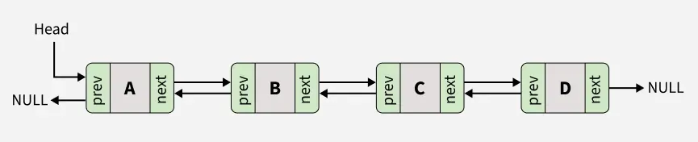
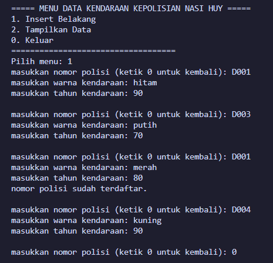
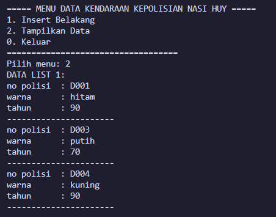
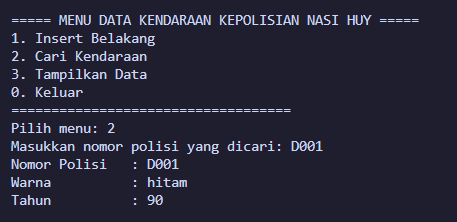
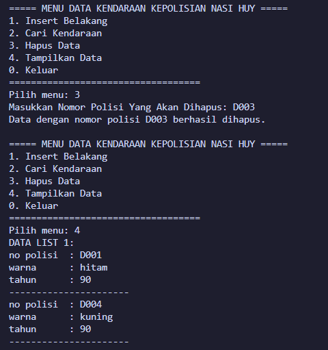

# <h1 align="center">Laporan Praktikum Modul 1 <br> PENGENALAN BAHASA C++ (BAGIAN PERTAMA)</h1>

<p align="center">KEISHIN NAUFA ALFARIDZHI - 103112400061</p>

## Dasar Teori

C++ adalah bahasa pemrograman tingkat tinggi yang dikembangkan oleh Bjarne Stroustrup pada awal 1980-an di Bell Labs. Dirancang sebagai versi yang lebih lengkap dari bahasa pemrograman C, ada banyak fitur tambahan yang disertakan oleh C++.

Fitur ini termasuk object-oriented programming (OOP), pengelolaan memori secara manual, dan penggunaan template generik. Hasilnya, bahasa pemrograman ini pun menjadi lebih fleksibel dan efisien untuk berbagai kebutuhan.

C++ juga dirancang untuk menangani proyek pemrograman kompleks, termasuk aplikasi dengan performa tinggi seperti sistem operasi dan software grafis. Selain itu, C++ mendukung berbagai gaya pemrograman, mulai dari prosedural, generik, hingga berorientasi objek sehingga cocok untuk pengembangan software skala besar.

Berikut merupakan konsep dasar dalam bahasa C++

### 1. **Variabel**

Variabel adalah tempat penyimpanan data dalam program, yang memiliki nama dan nilai tertentu. Di C++, variabel memiliki tipe data yang menentukan jenis nilai yang bisa disimpan.

Berikut adalah tipe-tipe data yang ada dalam variabel C++:

- bool: singkatan dari tipe data boolean, yang hanya berisi dua nilai, yaitu True atau False.
- char: kependekan dari character, yaitu tipe data huruf dari A sampai Z.
- int: kepanjangannya adalah integer, yaitu tipe berupa angka.
- float dan double: tipe data yang berupa angka pecahan, contohnya 1,33.
- string: tipe data dalam bentuk kumpulan karakter, seperti “bahasa pemrograman C++“.

Selain itu, variabel bisa bersifat konstan dengan kata kunci const, yang artinya nilainya tidak bisa diubah setelah ditentukan. C++ juga mendukung pointer, yaitu variabel yang menyimpan alamat memori sehingga developer bisa mengontrol memori secar langsung.

Penulisan variabel dalam C++ terdiri dari dua langkah, yaitu deklarasi dan inisialisasi.

### 2. **Syntax**

Sintaks merupakan pedoman dan peraturan yang harus diikuti ketika menuliskan baris kode/instruksi dalam bahasa pemrograman. Selain itu, sintaks juga dapat dipandang sebagai kerangka yang menentukan struktur bahasa pemrograman.

Bahasa C++ juga memiliki sintaks untuk fungsi-fungsi yang sudah disediakan. Instruksi yang berbeda memiliki sintaks yang berbeda yang menentukan penggunaannya, tetapi program C++ juga memiliki aturan sintaks dasar yang diikuti di seluruh program.

- #include <iostream> : bagian ini disebut preprocessor directive untuk menyertakan file header.

- <iostream> : memberikan akses ke fungsi input-output standar dalam C++.

- using namespace std : bagian ini disebut deklarasi yang memberi tahu program untuk menggunakan namespace std yang berisi banyak fungsi dan objek standar.

- int main() : bagian ini disebut deklarasi fungsi utama (main) yang merupakan pintu masuk eksekusi untuk program C++.

- { dan } : bagian ini disebut kurung kurawal membuka dan menutup blok baris kode untuk fungsi main.

- Semicolon ( ; ) : setiap baris kode dalam contoh di atas diakhiri dengan simbol titik koma ( ; ). Simbol ini berfungsi sebagai penanda akhir dari setiap baris kode dalam program. Ketika kompiler menemui titik koma ini, proses eksekusi pada baris tersebut dihentikan dan lanjut ke baris kode berikutnya.

- return 0; : bagian ini disebut pernyataan kembalian yang mengindikasikan bahwa program telah selesai dengan sukses, sedangkan 0 adalah kode keluaran yang menunjukkan tidak ada kesalahan.

### 3. **Komentar**

Komentar dalam bahasa pemrograman C++ bertujuan untuk memberikan penjelasan mengenai setiap baris kode dengan tujuan memudahkan pembacaan. Penulisan komentar ini dilakukan untuk menyediakan informasi yang relevan terkait dengan implementasi kode yang sedang dibuat. Praktik ini umum dilakukan oleh para programmer sebagai bagian dari dokumentasi proyek mereka.

### 4. **Operasi Aritmatika**

Aritmatika adalah cabang ilmu matematika yang membahas perhitungan dasar "kabataku", yakni operasi perkalian, pembagian, penambahan dan pengurangan.

Selain keempat operasi di atas, bahasa C++ juga memiliki operasi modulo division, atau operator % yang dipakai untuk mencari sisa hasil bagi.

Berikut merupakan operasi aritmatika yang dapat dilakukan dalam bahasa C++.

- +=: assignment penambahan (Contoh: A += 7 ekuivalen dengan A = A + 7).
- -= : assignment pengurangan.
- \*= : assignment perkalian.
- /= : assignment pembagian.
- %=: assignment mod.

### 5. **Control Structures**

Control structure mengatur alur eksekusi program berdasarkan kondisi tertentu. Ada beberapa control structure utama dalam C++, termasuk if-else untuk percabangan serta for, while, dan do-while untuk loop atau perulangan.

Dengan struktur ini, program bisa memberikan respons yang berbeda tergantung pada input atau kondisi yang terjadi selama runtime. Control structure memastikan efisiensi dalam pemrosesan, terutama saat menangani data besar atau algoritma yang kompleks.

**if**<br>
Statement `if` digunakan untuk mengevaluasi ekspresi logis yang menghasilkan nilai `true` atau `false`. Apabila nilainya `true`, blok kode di dalam `if` akan dieksekusi. Kalau tidak, blok tersebut akan dilewati.

**else if dan else**<br>
Apabila kondisi di dalam `if` bernilai `false`, Anda bisa menggunakan `else if` untuk memeriksa kondisi lainnya. Kalau semua kondisi `if` dan `else if` bernilai `false`, blok `else` akan dijalankan sebagai opsi terakhir.

**for**<br>
Loop `for` digunakan untuk melakukan pengulangan dengan jumlah yang diketahui. Struktur ini mencakup **inisialisasi**, **kondisi**, dan **inkrementasi/dekrementasi** dalam satu baris.

Contohnya adalah sebagai berikut:

```c++
...
int main() {
for (int i = 0; i < 5; i++) {
    cout << "Perulangan ke-" << i << endl;
}
```

Pada contoh di atas, variabel `i` diinisialisasi dengan nilai 0. Loop akan berulang selama `i < 5`, dan setiap kali loop berakhir, nilai `i` akan bertambah 1. Pengulangan akan berhenti saat kondisi `i < 5` tidak lagi terpenuhi.

**while**<br>
Loop `while` akan terus mengeksekusi blok kode selama ekspresi kondisional bernilai `true`. Pengulangan akan berhenti begitu kondisi menjadi `false`.

**do-while**<br>
Dengan `do-while`, blok kode akan dieksekusi minimal satu kali, bahkan meskipun kondisinya bernilai `false` saat pemeriksaan pertama. Setelah satu kali eksekusi, kondisi akan diperiksa untuk menentukan apakah loop akan dijalankan lagi.

### 6. **Function**

Sebuah Function dalam C++ adalah blok kode yang dapat menerima input (dalam bentuk parameter) dari pemanggilnya, melakukan serangkaian operasi, dan secara opsional mengembalikan nilai sebagai output. Function sangat berguna untuk mengorganisir kode secara terstruktur dan dapat digunakan kembali.

**Deklarasi Function**<br>
Sebuah deklarasi Function minimal terdiri dari tipe pengembalian, nama Function, dan daftar parameter.

**Definisi Function**<br>
Definisi Function terdiri dari deklarasi dan body Function. Body Function adalah bagian dari Function yang berisi kode yang akan dieksekusi ketika Function dipanggil.

**Parameter dan Argumen**<br>
Sebuah Function memiliki daftar parameter yang memungkinkan pemanggil untuk meneruskan argumen ke dalam Function. Argumen adalah nilai konkret yang dilewatkan ke Function. Anda dapat menggunakan referensi atau nilai untuk mem-pass argumen ke dalam Function.

**Jenis Return**<br>
Jenis return function merujuk pada nilai yang dikembalikan oleh suatu fungsi setelah melakukan operasi atau pemrosesan tertentu. Dalam bahasa pemrograman C++, sebuah function dapat mengembalikan berbagai jenis nilai tergantung pada kebutuhan dan logika programnya.

### 7. **Array**

Array merupakan struktur data yang digunakan untuk `menyimpan sekumpulan data` dalam satu tempat. Setiap data dalam Array memiliki indeks, sehingga kita akan mudah memprosesnya.

Indeks array selalu dimulai dari angka nol (`0`). Pada teori struktur data ukuran array akan bergantung dari banyaknya data yang disimpan di dalamnya.

**Cara Membuat Array pada C++**<br>
Pada C++, array dapat kita buat dengan cara seperti ini.

```c++
// membuat array kosong dengan tipe data integer dan panjang 10
int nama_array[10];

// membuat array dengan langsung diisi
int nama_arr[3] = {0, 3, 2}
```

Cara membuat array hampir sama seperti cara membuat variabel biasa. Bedanya pada array kita harus menentukan panjangnya.

**Cara Mengambil Data dari Array**<br>
Seperti yang sudah kita ketahui, array akan menyimpan sekumpulan data dan memberinya nomer indeks agar mudah diakses. Indeks array selalu dimulai dari nol `0`.

Misalkan kita punya array seperti ini: <br>
`char huruf[5] = {'a', 'b', 'c', 'd', 'e'};`<br>
Bagaimana cara mengambil huruf `c`?

Jawabannya:
`huruf[2];`

**Mengisi Ulang Data Array**<br>
Data pada array dapat kita isi ulang dengan cara seperti ini:<br>
`huruf[2] = 'z';`<br>
Maka isi array `huruf` pada indeks ke-2 akan bernilai z`.

### 8. **Linked List**

Dalam C++, linked list merupakan struktur data linear yang memungkinkan user untuk menyimpan data di lokasi memory yang tidak berurutan. Sebuah linked list didefinisikan sebagai sekumpulan nodes yang dimana tiap node memiliki 2 anggota: value node itu sendiri dan petunjuk next/previous yang menyimpan alamat node berikutnya/sebelumnya.

**Representasi Linked List dalam C++**<br>
Dalam C++, linked list pada dasarnya direpresentasikan oleh pointer ke node pertama, yang umumnya disebut sebagai "**head**" dari list tersebut. Setiam node dalam list didefinisikan oleh struktur yang mencakup data field dan pointer yang mengarah ke struktur dengan tipe yang sama. Jenis struktur ini dikenal sebagai struktur self-referential.

**Singly Linked List**<br>
Singly linked List adalah bentuk paling sederhana dari linked list, di mana setiap node mengandung 2 anggota yaitu data dan next pointer yang menyimpan alamat node berikutnya. Setiap node dalam singly linked list terhubung melalui petunjuk berikutnya, dan penunjuk beriutnya dari node terakhir mengarah ke NULL, yang menandakan akhir dari linked list. Diagram berikut menggambarkan struktur singly linked list: <br>


**Doubly Linked List**<br>
Doubly Linked List adalah jenis linked list yang di mana setiap node mengandung 3 bagian: data, pointer ke node berikutnya, dan pointer ke node sebelumnya. Struktur ini memungkinkan penelusuran daftar ke arah depan dan belakang, berbeda dengan Singly Linked List yang hanya dapat ditelusuri ke arah depan.


## Unguided

Di bawah ini merupakan code untuk pengerjaan unguided soal 1-3.

`Doublylist.h`

```c++
#ifndef SERVICE_H_INCLUDED
#define SERVICE_H_INCLUDED
#include <string>
using namespace std;

struct infotype {
    string nopol;
    string warna;
    int thnBuat;
};

struct ElmList;

using address = ElmList*;

struct ElmList {
    infotype info;
    address next;
    address prev;
};

struct List {
    address First;
    address Last;
};

void CreateList(List &L);
address alokasi(const infotype &x);
void dealokasi(address &P);
void printInfo(const List &L);
void insertLast(List &L, address P);
void findElm(List L, infotype x);
void deleteFirst(List &L, address &P);
void deleteLast(List &L, address &P);
void deleteAfter(List &L, address Prec, address &P);
void deleteElm(List &L, address &P, infotype x);

#endif
```

<br>

`Doublylist.cpp`

```c++
#include <iostream>
#include "Doublylist.h"
using namespace std;

void CreateList(List &L) {
    L.First = nullptr;
    L.Last = nullptr;
}

address alokasi(const infotype &x) {
    address P = new ElmList;
    P->info = x;
    P->next = nullptr;
    P->prev = nullptr;
    return P;
}

void dealokasi(address &P) {
    delete P;
}

void printInfo(const List &L) {
    address P = L.First;
    cout << "DATA LIST 1: \n";
    while (P != nullptr) {
        cout << "no polisi  : " << P->info.nopol << endl;
        cout << "warna      : " << P->info.warna << endl;
        cout << "tahun      : " << P->info.thnBuat << endl;
        cout << "----------------------\n";
        P = P->next;
    }
}

void insertLast(List &L, address P) {
    string cekNopol = P->info.nopol;
    address current = L.First;

    while (current != nullptr) {
        if (current->info.nopol == cekNopol) {
            cout << "nomor polisi sudah terdaftar.\n";
            dealokasi(P);
            return;
        }
        current = current->next;
    }

    if (L.First == nullptr) {
        L.First = P;
        L.Last = P;
    } else {
        L.Last->next = P;
        P->prev = L.Last;
        L.Last = P;
    }
}

void findElm(List L, infotype x) {
    address P = L.First;
    while (P != nullptr && x.nopol != P->info.nopol) {
        P = P->next;
    }
    if (P != nullptr) {
        cout << "Nomor Polisi   : " << P->info.nopol << endl;
        cout << "Warna          : " << P->info.warna << endl;
        cout << "Tahun          : " << P->info.thnBuat << endl;
    } else {
        cout << "Kendaraan dengan nomor polisi " << x.nopol << " tidak ditemukan.\n";
    }
}

void deleteFirst(List &L, address &P) {
    if (L.First == nullptr) {
        P = nullptr;
        return;
    }

    P = L.First;
    if (L.First == L.Last) {
        L.First = nullptr;
        L.Last = nullptr;
    } else {
        L.First = L.First->next;
        L.First->prev = nullptr;
    }
    P->next = nullptr;
}

void deleteLast(List &L, address &P) {
    if (L.Last == nullptr) {
        P = nullptr;
        return;
    }

    P = L.Last;
    if (L.First == L.Last) {
        L.First = nullptr;
        L.Last = nullptr;
    } else {
        L.Last = L.Last->prev;
        L.Last->next = nullptr;
    }
    P->prev = nullptr;
}

void deleteAfter(List &L, address Prec, address &P) {
    if (Prec == nullptr || Prec->next == nullptr) {
        P = nullptr;
        return;
    }
    P = Prec->next;

    Prec->next = P->next;

    if (P->next == nullptr) {
        L.Last = Prec;
    } else {
        P->next->prev = Prec;
    }
    P->next = nullptr;
    P->prev = nullptr;
}

void deleteElm(List &L, address &P, infotype x) {
    address temp = L.First;
    while (temp != nullptr && temp->info.nopol != x.nopol) {
        temp = temp->next;
    }
    if (temp == nullptr) {
        cout << "Kendaraan dengan nomor polisi " << x.nopol << " tidak ditemukan.\n";
        P = nullptr;
        return;
    }

    if (temp == L.First) {
        deleteFirst(L, P);
    } else if (temp == L.Last) {
        deleteLast(L, P);
    } else {
        deleteAfter(L, temp->prev, P);
    }
}
```

<br>

`main.cpp`

```c++
#include <iostream>
#include "Doublylist.h"
using namespace std;

int main() {
    List L;
    CreateList(L);
    infotype kendaraan;
    address deletedNode;

    int input;

    do {
        cout << "\n===== MENU DATA KENDARAAN KEPOLISIAN NASI HUY =====\n";
        cout << "1. Insert Belakang\n";
        cout << "2. Cari Kendaraan\n";
        cout << "3. Hapus Data\n";
        cout << "4. Tampilkan Data\n";
        cout << "0. Keluar\n";
        cout << "===================================\n";
        cout << "Pilih menu: ";
        cin >> input;

        switch (input) {
            case 1:
                while (true) {
                    cout << "masukkan nomor polisi (ketik 0 untuk kembali): ";
                    cin >> kendaraan.nopol;
                    if (kendaraan.nopol == "0") {
                        break;
                    }
                    cout << "masukkan warna kendaraan: ";
                    cin >> kendaraan.warna;
                    cout << "masukkan tahun kendaraan: ";
                    cin >> kendaraan.thnBuat;
                    insertLast(L, alokasi(kendaraan));
                    cout << endl;
                };
                break;
            case 2:
                cout << "Masukkan nomor polisi yang dicari: ";
                cin >> kendaraan.nopol;
                findElm(L, kendaraan);
                break;
            case 3:
                cout << "Masukkan Nomor Polisi Yang Akan Dihapus: ";
                cin >> kendaraan.nopol;
                deleteElm(L, deletedNode, kendaraan);
                if (deletedNode != nullptr) {
                    dealokasi(deletedNode);
                    cout << "Data dengan nomor polisi " << kendaraan.nopol << " berhasil dihapus.\n";
                }
                break;
            case 4:
                printInfo(L);
                break;
            case 0:
                cout << "👋 Keluar dari program.\n";
                break;
            default:
                cout << "Pilihan tidak valid.\n";
        }
    } while (input != 0);

    return 0;
}
```

### Unguided 1

Buatlah ADT Doubly Linked list sebagai berikut di dalam file “Doublylist.h”:

```
Type infotype : kendaraan <
    nopol : string
    warna : string
    thnBuat : integer
>
Type address : pointer to ElmList
Type ElmList <
    info : infotype
    next :address
    prev : address
>

Type List <
    First : address
    Last : address
>

procedure CreateList( input/output L : List )
function alokasi( x : infotype ) → address
procedure dealokasi(input/output P : address )
procedure printInfo( input L : List )
procedure insertLast(input/output L : List,
   input P : address )
```

Buatlah implementasi ADT Doubly Linked list pada file “Doublylist.cpp” dan coba hasil
implementasi ADT pada file “main.cpp”.

> output<br>

Program sistem data kendaraan kepolisian. Menggunakan doubly-linked list sebagai wadah penyimpanand data kendaraan. Terdapat 3 buah file yang terdiri dari 1 file header (`Doublylist.h`), 1 file ADT (`Doublylist.cpp`), dan 1 file utama (`main.cpp`).

1. Doublylist.h: File header ini bekerja sebagai interface, mendeklarasikan semua struct dan function.

   - struct infotype: Menyimpan data kendaraan (nopol, warna, thnBuat).

   - struct ElmList: Mendefinisikan node yang berisi info, pointer next, dan pointer prev.

   - struct List: Menyimpan pointer ke elemen pertama (First) dan elemen terakhir (Last).

2. Doublylist.cpp: File implementasi ini berisi logic dari semua function yang dideklarasikan di dalam file header.

   - `CreateList()`: Prosedur untuk inisialisasi list. Mengatur First dan Last menjadi nullptr yang menandakan list masih kosong.

   - `alokasi()`: Function ini membuat node baru di memori (new ElmList), mengisinya dengan infotype, dan mengembalikan address dari node baru tersebut.

   - `insertLast()`: Prosedur ini menambahkan node di akhir list. Terdapat validasi unik untuk nopol. Jika nopol sudah ada, node baru akan di-dealokasi dan insert akan dibatalkan. Jika list kosong (`L.First == nullptr`), node baru menjadi First dan Last. Jika tidak, node baru disambungkan setelah `L.Last.`

3. `main.cpp`: File utama yang berisi menu program. File ini memanggil function dari `Doublylist.cpp` untuk menjalankan operasi list.

### Unguided 2

Carilah elemen dengan nomor polisi D001 dengan membuat fungsi baru.
fungsi findElm( L : List, x : infotype ) : address

> output<br>

Prosedur findElm() digunakan untuk mencari data kendaraan berdasarkan nomor polisi (nopol).

- Algoritma yang digunakan adalah Sequential Search.

- Pencarian dimulai dari `L.First` menggunakan pointer P.

- Loop while akan terus berjalan `(P = P->next)` selama P belum nullptr (belum akhir list) dan nopol yang dicari `(x.nopol)` belum ditemukan `(P->info.nopol)`.

- Setelah loop berhenti, ada dua kemungkinan:

  1. Jika `P != nullptr`, loop berhenti karena nopol ditemukan. Program akan print detail kendaraan.

  2. Jika `P == nullptr`, loop berhenti karena sudah sampai akhir list dan data tidak ditemukan. Program akan print "tidak ditemukan".

### Unguided 3

Hapus elemen dengan nomor polisi D003 dengan procedure delete.

- procedure deleteFirst( input/output L : List,  
  P : address )
- procedure deleteLast( input/output L : List,  
  P : address )
- procedure deleteAfter( input Prec : address,  
  input/output P : address )

> output<br>

Function untuk menghapus data dipecah menjadi beberapa prosedur (helper) untuk menangani setiap kasus secara spesifik dengan prosedur utamanya adalah `deleteElm()`.

Cara kerja `deleteElm()`:

1. Search Data: Langkah pertama adalah mencari node yang akan dihapus menggunakan algoritma Sequential Search, mirip dengan `findElm()`. Pointer `temp` akan berjalan dari L.First sampai menemukan nopol yang cocok atau sampai `temp` menjadi nullptr.

2. Tentukan Posisi: Setelah loop, jika `temp` adalah nullptr, berarti data tidak ditemukan. Jika data ditemukan, program akan mengecek posisi `temp`:

   - Jika `temp == L.First`, panggil `deleteFirst()`.

   - Jika `temp == L.Last`, panggil `deleteLast()`.

   - Jika bukan keduanya (data di tengah), panggil `deleteAfter()`. Dapatkan node sebelumnya `(temp->prev)` untuk dijadikan parameter `Prec` pada `deleteAfter()`.

Prosedur Helper:

- `deleteFirst(List &L, address &P)`: Menghapus elemen pertama dari list. Pointer `L.First` digeser ke `L.First->next`. Kemudian, `prev` dari `L.First` yang baru diatur menjadi nullptr.

- `deleteLast(List &L, address &P)`: Menghapus elemen terakhir dari list. Pointer `L.Last` digeser ke `L.Last->prev`. Kemudian, `next` dari `L.Last` yang baru diatur menjadi nullptr.

- `deleteAfter(List &L, address Prec, address &P)`: Menghapus node `P` yang berada setelah `Prec`. `Prec->next` dihubungkan ke `P->next`, dan `P->next->prev` disambungkan kembali ke `Prec`.

Di `main.cpp`, variabel `deletedNode` dioper by reference ke `deleteElm()`. Bertujuan agar `deleteElm()` dapat return alamat dari node yang telah diputus.

Setelah itu, `main()` akan memanggil `dealokasi(deletedNode)`. dealokasi sangat penting untuk return memori yang sudah tidak terpakai ke sistem dan mencegah memory leak.

## Referensi

1. _Hostinger_. https://www.hostinger.com/id/tutorial/bahasa-pemrograman-cpp. Diakses pada 03 Oktober 2025.
2. _Dicoding_. https://www.dicoding.com/blog/memahami-esensi-bahasa-pemrograman-c/. Diakses pada 03 Oktober 2025.
3. _Duniailkom_. https://www.duniailkom.com/tutorial-belajar-c-plus-plus-jenis-jenis-operator-aritmatika-bahasa-c-plus-plus/. Diakses pada 03 Oktober 2025.
4. _kodingakademi_. https://www.kodingakademi.id/function-c-panduan-lengkap/. Diakses pada 03 Oktober 2025.
5. _petanikode_ . https://www.petanikode.com/cpp-array/. Diakses pada 06 Oktober 2025.
6. _GeekForGeeks_. https://www.geeksforgeeks.org/cpp/cpp-linked-list/. Diakses pada 13 Oktober 2025.
7. _GeekForGeeks_. https://www.geeksforgeeks.org/cpp/doubly-linked-list-in-cpp/. Diakses pada 27 Oktober 2025.
